# Relintor Complete Technical Anatomy
## Architecture, Authority, Data, Execution, Verification, Security and Release System

> **Document status:** repository-grounded technical reference, written from the current workspace on 2026-08-18.
>
> **Evidence rule:** `VERIFIED` means the repository contains an executable test, a successful recorded local gate, or a directly inspectable implementation that proves the statement. `IMPLEMENTED / NOT LIVE VERIFIED` means source and deterministic tests exist but a required real external environment has not executed. `PARTIALLY IMPLEMENTED` means only a foundation or boundary exists. `FUTURE` means the capability is described as intended but is not a current product claim. `OUT OF CURRENT BETA SCOPE` means this document deliberately does not treat it as a Windows closed-beta guarantee.

## Current repository audit addendum — 2026-08-18

The requested `PROJECT_CONTEXT_TRANSFER.md` was not present in the repository,
the workspace attachment area, or the repository file search. Its historical
claims and its promised final documentation-package list are therefore
`UNVERIFIED`; the repository, executable artifacts, tests and current evidence
ledger are authoritative for this snapshot. The detailed audit is recorded in
[`RELINTOR_REPOSITORY_VERIFICATION.md`](RELINTOR_REPOSITORY_VERIFICATION.md).

The active Tauri configuration now contains an explicit, inert updater object
with an empty public key and empty endpoint list. This prevents the historical
`plugins.updater = null` startup deserialization panic. The native updater code
still requires `RELINTOR_UPDATE_PUBLIC_KEY` and `RELINTOR_UPDATE_ENDPOINT` before
building an updater, so signing and live updates remain unavailable rather than
being faked. The old `tauri.conf.before-updater-fix.json` and
`relintor-launch-err.txt` are historical evidence, not active runtime state.

Current x64 artifacts exist, but deployment evidence is not yet one consistent
chain: `apps/website/public/downloads` matches the newer x64 installer while
`apps/website/dist/downloads` still contains the older installer hash. A website
rebuild/redeployment and a direct launch test with an explicit exit code remain
required before calling the closed-beta journey ready.

## Table of contents

1. [Executive technical summary](#1-executive-technical-summary)
2. [Complete repository anatomy](#2-complete-repository-anatomy)
3. [Technology inventory](#3-technology-inventory)
4. [Authority model](#4-authority-model)
5. [Requirement state machine](#5-requirement-state-machine)
6. [Complete mission lifecycle](#6-complete-mission-lifecycle)
7. [Antigravity integration](#7-antigravity-integration)
8. [Desktop application anatomy](#8-desktop-application-anatomy)
9. [Local-first data model](#9-local-first-data-model)
10. [Cloud API](#10-cloud-api)
11. [Google authentication flow](#11-google-authentication-flow)
12. [AI Gateway](#12-ai-gateway)
13. [Evidence system](#13-evidence-system)
14. [Verification system](#14-verification-system)
15. [Recovery and repair loop](#15-recovery-and-repair-loop)
16. [Security model](#16-security-model)
17. [The locked specification](#17-the-locked-specification)
18. [Testing system](#18-testing-system)
19. [Windows build and release anatomy](#19-windows-build-and-release-anatomy)
20. [Deployment topology](#20-deployment-topology)
21. [Configuration inventory](#21-configuration-inventory)
22. [Error and failure model](#22-error-and-failure-model)
23. [Release gates](#23-release-gates)
24. [Design decision register](#24-design-decision-register)
25. [Engineer handoff checklist](#25-engineer-handoff-checklist)
26. [Example: adding a new evidence type](#26-example-adding-a-new-evidence-type)
27. [What Relintor is not](#27-what-relintor-is-not)
28. [Current technical status](#28-current-technical-status)

---

## 1. Executive technical summary

Relintor is a local-first authority and verification system for software that
may be built or changed by an AI coding executor. It turns a user's intent into
a scoped mission, turns the mission into requirements and acceptance criteria,
controls execution, collects requirement-specific evidence, and makes a final
decision from persisted evidence rather than from the executor's message.

Its core promise is:

> **Don't trust done. Prove it.**

Relintor is therefore not simply another AI coding IDE. An ordinary coding
assistant can be useful while still being the wrong authority to say that a
project is complete. Relintor separates the worker from the inspector:

| Concept | Technical meaning in this repository |
|---|---|
| User intent | The request, project facts, decisions, and constraints supplied by a user or discovered during takeover. |
| Mission | A persisted, revisioned unit of work with a project identity, requirement graph, task graph, and seal. |
| Requirement | A single obligation with source, priority/risk, acceptance criteria, evidence obligations, and a state. |
| Execution | Bounded task scheduling through the P7 execution model and an adapter boundary. |
| Antigravity | The intended execution adapter/CLI/plugin boundary. Detection and safety primitives exist; production plugin packaging and live runtime certification remain incomplete. |
| Evidence | Structured, hashed, bounded artifacts such as source diffs, builds, tests, API observations, browser observations, and security scans. |
| Verifier | The deterministic evidence evaluator. It checks freshness, scope, bindings, required obligations, and completion rules. |
| Completion decision | The persisted decision computed by verification, not a renderer or executor assertion. |
| Completion certificate | A signed/integrity-bound artifact produced only after the completion authority accepts the report. |

### The completion authority rule

The coding agent, Antigravity process, renderer, AI verifier, and user-facing
status text are not independently allowed to mint authoritative final
completion. An executor may produce a process result or say `done`; that is an
input to evidence collection. The verifier must still establish that every
required criterion has adequate, fresh, correctly bound evidence and that no
deterministic gate failed or was silently skipped.

The distinction is deliberately strict:

```text
executor says “done”
        ↓
process/output/evidence is collected
        ↓
evidence is bound to a sealed requirement and criterion
        ↓
freshness, integrity, scope, and failure rules are checked
        ↓
verification computes a requirement and mission state
        ↓
only completion authority may issue a certificate
```

`IMPLEMENTED` is a source or execution claim. `VERIFIED` is a decision backed
by accepted evidence. The first must never be silently promoted to the second.

### Current disposition in one paragraph

The local Rust, desktop, specification, evidence-integrity, standards,
orchestration, recovery, security, and Windows x64 build gates have substantial
passing evidence. The current repository is not a fully release-certified
Antigravity product: P12 records automatic signed update integration,
uninstall/export product integration, and the production signed Antigravity
plugin/adapter boundary as release-stopping implementation gaps. Live
PostgreSQL, live Antigravity, live AI-provider, macOS/Linux, clean-machine
distribution, signing, rollout, and non-expert usability gates remain either
external or not run. This document does not upgrade those states.

---

## 2. Complete repository anatomy

### 2.1 Important tree

```text
Relintor/
├── apps/
│   ├── desktop/
│   │   ├── src/                         React/TypeScript renderer and API bridge
│   │   └── src-tauri/                   Tauri shell, Rust authority, config, icons
│   ├── admin/                            React organization/admin portal
│   └── website/                          React public website surface
├── crates/
│   ├── relintor-core/                   SQLite, health, locked-spec and detection core
│   ├── relintor-contracts/              Shared entitlement contracts and signatures
│   ├── relintor-evidence/               Evidence collection, verification and certificates
│   ├── relintor-distribution/           Signed update/export/uninstall safety primitives
│   ├── relintor-execution/              P7 scheduler, watchdog, leases and recovery
│   ├── relintor-standards/              P6 standards, applicability, graph and seals
│   ├── relintor-antigravity/             Detection, packets, process and bridge boundary
│   ├── relintor-investigator/            P4 project/intent investigation
│   └── relintor-takeover/                P5 read-only repository takeover scanner
├── services/
│   ├── cloud-api/                        PostgreSQL-backed account/session authority
│   └── ai-gateway/                       Authenticated provider gateway
├── packages/
│   ├── config/                           Workspace package placeholder
│   ├── contracts/                        TypeScript cloud/admin response contracts
│   └── ui/                               Workspace UI package placeholder
├── db/
│   ├── migrations/                       Ten additive SQL migration files
│   ├── schema/                           Schema documentation area
│   └── seeds/                            Seed documentation area
├── integrations/antigravity/             Compatibility registry and bridge contract
├── packaging/                            Windows/macOS/Linux/signing release areas
├── standards/registry/                   Versioned production standards registry
├── spec/locked/                          Immutable product/specification inputs
├── tests/                                Reserved adversarial, integration and fixture areas
└── tooling/
    ├── acceptance/                       Spec, traceability, secret and audit scripts
    ├── evidence/                         Milestone/audit reports
    └── spec/                             Locked-spec verifier
```

### 2.2 What each major area can and cannot do

| Area | What it is | What calls it | What it calls | Authority it has | Authority it must not have |
|---|---|---|---|---|---|
| `apps/desktop/src` | Renderer and user interaction layer | User/browser events; Tauri invokes | `apps/desktop/src/backend.ts`, Tauri commands | Display state; request operations | Minting evidence, certificates, sessions, entitlements, or completion |
| `apps/desktop/src-tauri` | Native shell and Rust command boundary | Renderer commands and Tauri lifecycle | Core crates, local SQLite, HTTPS cloud/auth, evidence/execution services | Local authority coordination and token custody in Rust memory | Treating renderer values as trusted authority; embedding server secrets |
| `apps/admin` | Current cloud/admin portal UI | Operator input | TypeScript cloud API client | Requesting/displaying organization/admin data | Bypassing server role/MFA/tenant checks |
| `apps/website` | Public website React app | Browser navigation | Its own frontend assets | Public explanation/presentation | Product or verification authority |
| `relintor-core` | Local database, health, spec integrity, discovery | Desktop shell | SQLite, filesystem, Antigravity detection | Local health and migration operations | Declaring mission completion |
| `relintor-investigator` | Structured intent and takeover-informed investigation | Desktop shell | Local project inputs/corpus | Produce an inspectable blueprint | Claim implementation or verification |
| `relintor-takeover` | Read-only source/repository scanner | Desktop command | Imported repository files and bounded probes | Record facts, findings, dependencies and fingerprints | Execute imported code in place or classify from comments alone |
| `relintor-standards` | P6 applicability and requirement graph authority | Desktop and persistence paths | Registry, facts, SQLite | Build drafts, DAGs, seals and revision-scoped authority | Trust mutable UI state after sealing |
| `relintor-execution` | P7 scheduler/watchdog/recovery model | Desktop shell | Antigravity adapter, ledger, filesystem | Schedule bounded work and stop unsafe loops | Mark work verified or change a P6 seal |
| `relintor-antigravity` | Adapter and process safety boundary | Execution crate/core detection | `agy`/candidate executable and structured protocol | Validate commands, paths, packets, process results, hooks | Substitute a mock for production runtime proof |
| `relintor-evidence` | Evidence store/collectors/verifier/certificates | Desktop verification commands | Build/test/API/browser/security collectors | Accept/reject bound evidence and issue completion certificate when eligible | Trust free-form agent text as proof |
| `relintor-distribution` | Update/export/uninstall safety primitives | Desktop distribution code/tests | Filesystem and signed manifests | Verify/stage/export/preserve allowed state | Claim the full product updater/uninstall path is integrated |
| `services/cloud-api` | Server identity/session/entitlement/admin authority | Desktop and AI Gateway | PostgreSQL or memory test store, Google JWKS, contracts | Account, org, session, entitlement and admin decisions | Accept arbitrary bearer strings or client-side grants |
| `services/ai-gateway` | Server-side AI provider boundary | Desktop P8 provider and clients | Cloud session endpoint and provider adapter | Validate sessions, budgets, provider deadlines and response shape | Expose provider keys or accept arbitrary bearer text |
| `db/migrations` | Durable PostgreSQL schema history | Cloud migration runner | PostgreSQL | Create/alter durable cloud objects | Rewrite applied history or make SQLite prove PostgreSQL behavior |
| `tooling/acceptance` | Repository verification scripts | Engineers/CI/manual gates | Python, filesystem, source and test outputs | Detect structural/secret/traceability regressions | Replace runtime tests with text presence claims |
| `spec/locked` | Sealed product requirements and phase rules | Core spec-health code and verifier | Manifest/hash verification | Define immutable requirements | Be rewritten by documentation or implementation |

### 2.3 Verified repository counts

These counts are snapshots derived from the current workspace, not product
marketing numbers:

| Count | Value | Derivation |
|---|---:|---|
| Applications under `apps/` | 3 | Directory enumeration: desktop, admin, website. |
| Rust workspace members | 12 | `Cargo.toml` workspace `members` list. This includes the Tauri crate, 9 crates under `crates/`, and 2 services. |
| Reusable crate directories | 9 | Directory enumeration under `crates/`. |
| Services | 2 | `services/cloud-api` and `services/ai-gateway`. |
| Workspace package directories | 3 | Directory enumeration under `packages/`: config, contracts, ui. |
| Rust source files | 41 | Current `.rs` files under `crates/`, `services/` and `apps/desktop/src-tauri`, excluding generated Tauri schema and build output. |
| TypeScript/TSX application source files | 16 | Current `.ts`/`.tsx` files under `apps/`, excluding `node_modules` and `dist`. |
| Python tooling scripts | 14 | `rg --files -g '*.py'`, excluding dependency trees. |
| SQL migrations | 10 | SQL files under `db/migrations`, numbered 001 through 010. |
| Locked specification files | 18 | `python tooling/spec/verify_spec.py` and directory enumeration. |
| Locked feature records | 144 | Spec verifier reports `features=144` and `unique_ids=144`; the feature register is A-01 through L-12. |
| Acceptance Python scripts | 13 | Python files under `tooling/acceptance`. |
| Rust integration-test files | 19 | `.rs` files under the six crate `tests/` directories. Unit tests embedded in Rust modules are not included in this count. |
| Frontend test files | 3 | `App.test.tsx` in desktop, admin, and website. |
| Existing Markdown files before this foundation | 66 | `rg --files -g '*.md'` excluding dependency/build trees; this includes audit/evidence, README and locked-spec material. |

The count of tests *executed* is different from the count of test files. The
canonical P12 report records the full workspace result as 263 passed, 0 failed,
2 ignored, and separately records desktop 10 frontend tests, admin 6, and
website 2. The ignored tests require a disposable PostgreSQL URL and are not
silently treated as passing.

### 2.4 Configuration and release areas

The root `Cargo.toml` pins the workspace edition to 2021 and Rust version to
1.96. The root `package.json` declares pnpm 11.17.0 as the package manager and
exposes spec, traceability, and desktop commands. `rust-toolchain.toml` asks
for the minimal Rust profile plus `rustfmt` and `clippy`.

The Tauri configuration is repository-relative: frontend build commands point
at the desktop app, the application identifier is `com.relintor.desktop`, the
window title is `Relintor Beta`, and bundle icons are under `src-tauri/icons`.
The configuration does not select an x64-only path or embed a development
machine path. Actual ARM64 packaging still requires a target-specific release
run; architecture-neutral configuration is not the same as completed ARM64
certification.

---

## 3. Technology inventory

| Technology | Version/status provable here | Where used | Why it exists | Runtime or build-time | Security and limitations |
|---|---|---|---|---|---|
| Rust | Workspace `rust-version = 1.96`; toolchain file channel `1.96.0` | All Rust crates and services | Strong typing, native authority, bounded process/filesystem control | Build-time and desktop/cloud runtime | Rust safety does not make external inputs trusted; authority rules still matter. |
| Tauri | Major version 2 in Rust and CLI dependencies | `apps/desktop/src-tauri` | Native shell around a React renderer | Runtime and build-time | Tauri commands are a trust boundary; renderer data must be validated. |
| React | Version range in app manifests; exact resolved package belongs to lockfile | Desktop, admin and website | Component UI and state presentation | Runtime/browser bundle | UI state is non-authoritative and may be stale or a browser preview. |
| TypeScript | Version range in app manifests | Frontend apps and shared contracts | Typed UI/API boundary | Build-time, emitted JavaScript at runtime | Types do not validate hostile server input by themselves. |
| Vite | Version range in app manifests | Frontend builds/dev servers | Fast frontend bundling | Build-time/dev only | Dev server URLs are not production topology. |
| pnpm | Root package manager `pnpm@11.17.0` | Workspace installs/scripts | Frozen workspace dependency installation | Build/development | `pnpm-lock.yaml` is a reproducibility input and must remain frozen during release validation. |
| SQLite | `rusqlite` with bundled SQLite in desktop/core manifests | Local desktop database | Local-first projects, authority revisions, execution/evidence persistence | Desktop runtime | Local database health is not PostgreSQL health. |
| PostgreSQL | `postgres` Rust client; migrations 002–010 | Cloud API | Durable users, orgs, sessions, entitlements, usage, subscriptions and admin audit | Cloud runtime and integration tests | Live migration/account round trip remains externally pending in the current record. |
| HTTPS/reqwest | `reqwest` blocking/json/rustls features | Desktop auth, Cloud API JWKS, AI gateway client | Bounded network calls without exposing provider secrets | Runtime | Endpoints are checked for HTTPS where required; timeouts and fail-closed handling are essential. |
| Google OIDC/OAuth | System browser, authorization code, PKCE S256 | Desktop sign-in and Cloud API exchange | Uses Google identity without a desktop client secret | Runtime integration | Local deterministic token/JWKS tests pass; real Google login is not certified in this documentation snapshot. |
| `ring` RSA verification | `ring` dependency in cloud API | Google JWKS/JWT validation | Verify RS256 ID-token signatures | Cloud runtime/test | Issuer, audience, expiry, subject and verified email checks are part of the validator. |
| DeepSeek provider boundary | Provider adapter in AI Gateway; key is server-side configuration | AI Gateway | Execute AI review without user/provider keys in desktop | Cloud runtime | Actual provider call is an external gate, not claimed from unit tests. |
| Antigravity CLI/bridge | Registry supports version prefix `1.`; CLI names include `agy`/`agy.exe` | Core detection and `relintor-antigravity` | Intended execution adapter | Desktop runtime when installed; build independent | Detection alone reports unknown compatibility; signed production bridge is not present. |
| Ed25519/HMAC/SHA-256 | Rust dependencies and source helpers | Entitlements, seals, evidence, fingerprints and integrity records | Bind artifacts and claims to authority inputs | Runtime/test | Integrity proofs prevent tampering but do not prove an external service ran. |
| NSIS/Tauri bundling | Tauri targets `all`; P12 records local NSIS build | Windows release path | Installer packaging | Build/release only | Local installer was unsigned; clean install/upgrade/uninstall remains not run. |
| Rust tests | Cargo test targets, 19 integration files plus unit modules | All Rust components | Deterministic behavior and adversarial guards | Build/test only | No deterministic test substitutes for live Google, PostgreSQL, provider, or Antigravity. |
| Vitest + Testing Library | App manifests and test files | Desktop/admin/website | Renderer behavior tests | Build/test only | Tests run in a browser-like environment, not a native Windows user session. |
| ESLint and TypeScript compiler | App scripts | Frontend | Static quality gates | Build/test only | Passing lint/typecheck does not prove runtime integration. |
| Python spec/traceability/secret tooling | `tooling/spec` and `tooling/acceptance` | Repository gates | Check locked requirements, metadata and secret patterns | Build/release only | A source scan cannot prove an external runtime behavior. |

### 3.1 Decision context that is explicit in the source

The code and evidence consistently choose Rust-owned authority, a local-first
SQLite boundary, server-side cloud/provider secrets, system-browser PKCE, a
requirement/evidence graph, and fail-closed unavailable states. A GUI-click
automation layer is not the architectural foundation; structured process and
bridge protocols are the intended boundary. The P12 record is explicit that
the signed production Antigravity plugin and actual update/uninstall product
paths are not yet complete.

---

## 4. Authority model

### 4.1 Authority matrix

| Actor/component | Can read | Can write/request | Can verify | Can declare final completion | Can mint authoritative state | Must never be trusted for |
|---|---|---|---|---|---|---|
| User | Their intent and visible status | Supply intent, choices and explicit decisions | Human review of visible material | No; the user can accept or stop, but not forge a certificate | Explicit decision records only, within policy | Claiming a technical check occurred without evidence |
| React renderer | API response models and visible status | Invoke allowed Tauri commands; local UI preferences | No independent verification | No | No | Tokens, certificates, completion, entitlements or hidden authority |
| Tauri/Rust backend | Local DB, filesystem within policy, cloud responses | Execute validated commands, persist state, call services | Coordinates authoritative checks | Only through bound backend engines, not arbitrary UI state | Local command results and persisted transitions | Blindly trusting renderer arguments or agent text |
| Mission/standards engine | Sealed facts, registry, requirement/task graph | Create revisions and seals | Validates decisions, graph and seal integrity | No; it prepares authority for execution/verification | Sealed mission revision and handoff | Mutable post-seal UI plans |
| P7 execution/watchdog | Sealed handoff, task packets, process events | Schedule, pause, stop, retry, record ledger | Execution health and process results | No; finished tasks await verification | Execution ledger, stop/retry outcomes | Treating successful process exit as requirement proof |
| Antigravity/executor | Its task packet and worktree/process context | Modify authorized project state and emit structured output | No independent mission verification | No | Process/output records only | “Done”, “tests pass”, or free-form claims |
| Evidence collectors | Authorized workspace and bounded command outputs | Store hashed structured artifacts | Collect and bind evidence; do not decide alone | No | Evidence artifacts and invalidation records | Unbounded logs, unrelated files, or unbound claims |
| Verifier/completion authority | Sealed requirements, evidence store, execution authority | Evaluate and issue decision/certificate | Yes, requirement by requirement | Yes, only when all policy rules pass | Completion report and certificate | Missing, stale, failed, skipped or weak evidence |
| Recovery system | Authenticated checkpoints and current workspace fingerprint | Resume safely or stop incomplete | Detect drift, interruption and invalidation | No | Recovery disposition/checkpoints | Resuming after authority drift without revalidation |
| Cloud API | Authenticated session, org, entitlement and admin records | Create/rotate/revoke sessions, issue policy/entitlement responses | Server-side identity/tenant/MFA checks | No local mission completion | Account/session/entitlement/admin records | Arbitrary bearer strings or client-supplied grants |
| AI Gateway | Authenticated Relintor cloud session and minimized request | Call server-side provider under budget/deadline | Structured response parsing only | No | Provider response receipt, not verification | Provider text as proof or desktop-supplied provider secret |
| Admin UI | Server-returned org/billing/admin data | Request allowed admin mutations | No; server enforces role/MFA/tenant | No | No | Access-token text or UI-selected role |
| Database | Persisted records and relational constraints | Accept transactions through owning service | No semantic completion decision | No | Durable rows only | A row's existence as proof of runtime behavior |

### 4.2 Why the renderer is not authoritative

The renderer can be replaced, paused, previewed in a browser, or fed stale
responses. It has no direct authority over the local SQLite schema, OS keychain,
process identity, PostgreSQL session, signing keys, or evidence integrity. The
desktop backend intentionally returns summaries such as account status,
execution status and verification views rather than raw tokens or authority
keys. A browser preview explicitly returns unavailable states when Rust-backed
operations cannot run.

### 4.3 Why an executor's success is insufficient

An executor can compile the wrong project, run the wrong test, omit a required
criterion, run with a modified environment, or report a result from a different
worktree. Relintor therefore binds commands and evidence to requirement IDs,
criterion IDs, source revisions, workspace fingerprints and collector identity.
The verifier then decides whether the evidence satisfies the obligation. This
is the technical meaning of “governs the executor; it does not merely copy what
the executor says.”

### 4.4 Trust boundary diagram

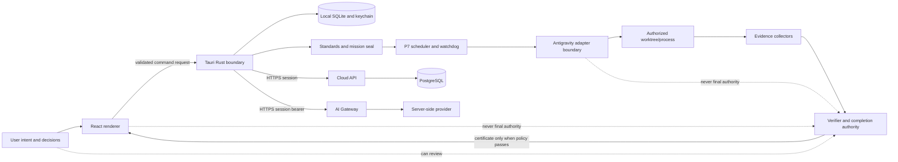

---

## 5. Requirement state machine

### 5.1 Actual requirement states

The canonical enum is `RequirementStatus` in `relintor-standards` and is
serialized in screaming snake case.

| State | Meaning | Evidence expectation | Typical allowed next states | Dangerous invalid transition |
|---|---|---|---|---|
| `UNSTARTED` | The obligation exists but work has not begun. | No implementation evidence is required yet. | `IN_PROGRESS`, `NOT_APPLICABLE`, `DEFERRED_BY_EXPLICIT_DECISION`, `BLOCKED`. | Treating a requirement's existence as implementation. |
| `IN_PROGRESS` | Work is being attempted. | Work may produce intermediate artifacts; they do not verify the requirement. | `IMPLEMENTED_UNVERIFIED`, `FAILED`, `BLOCKED`, `IN_PROGRESS`. | Calling in-progress work complete. |
| `IMPLEMENTED_UNVERIFIED` | Source/work appears implemented, but required proof is missing or not accepted. | At least implementation evidence may exist; verification obligations remain open. | `VERIFIED`, `FAILED`, `BLOCKED`, `REVALIDATION_REQUIRED` through surrounding authority. | Upgrading from a code diff alone to `VERIFIED`. |
| `VERIFIED` | All required acceptance/evidence rules for this requirement passed with fresh, bound evidence. | Requirement-specific evidence must be accepted. | Revalidation or failure if inputs later change; no casual downgrade/upgrade. | Reusing stale evidence after source/lock/environment change. |
| `FAILED` | A deterministic check or acceptance criterion failed. | A failure artifact/result should remain visible. | `IN_PROGRESS`, `IMPLEMENTED_UNVERIFIED`, `BLOCKED`, revalidation. | Hiding a failed test because another test passed. |
| `BLOCKED` | Required progress or proof is prevented by an external or policy boundary. | Blocker must be explicit; no pass is inferred. | `IN_PROGRESS`, `IMPLEMENTED_UNVERIFIED`, `VERIFIED` after proof, or stopped state. | Converting missing external proof into `VERIFIED`. |
| `NOT_APPLICABLE` | An authority-backed applicability decision excludes the requirement. | Explicit decision and reason are required. | Usually stable for the sealed revision; revalidation can reopen if facts change. | Deleting a requirement without an applicability record. |
| `DEFERRED_BY_EXPLICIT_DECISION` | A user/authority decision defers the obligation under policy. | Explicit actor, reason, scope and consequence are required. | Reopened/in progress in a later revision, or accepted according to policy. | Treating a deferral as a pass. |

`IMPLEMENTED_UNVERIFIED` is intentionally useful: it lets a team say “the
work appears present” without lying that it has been proven. The verifier also
tracks failed, skipped, stale and externally blocked evidence separately.

### 5.2 Requirement state diagram

```mermaid
stateDiagram-v2
    [*] --> UNSTARTED
    UNSTARTED --> IN_PROGRESS
    UNSTARTED --> NOT_APPLICABLE: explicit applicability decision
    UNSTARTED --> DEFERRED_BY_EXPLICIT_DECISION: explicit defer
    UNSTARTED --> BLOCKED: dependency unavailable
    IN_PROGRESS --> IMPLEMENTED_UNVERIFIED: source/work exists
    IN_PROGRESS --> FAILED: deterministic failure
    IN_PROGRESS --> BLOCKED: external/policy blocker
    IMPLEMENTED_UNVERIFIED --> VERIFIED: all bound evidence passes
    IMPLEMENTED_UNVERIFIED --> FAILED: required check fails
    IMPLEMENTED_UNVERIFIED --> BLOCKED: proof unavailable
    FAILED --> IN_PROGRESS: repair
    BLOCKED --> IN_PROGRESS: blocker cleared
    DEFERRED_BY_EXPLICIT_DECISION --> IN_PROGRESS: later revision reopens
    VERIFIED --> IMPLEMENTED_UNVERIFIED: input changed; revalidation required
```

### 5.3 Final mission states

The evidence completion model uses a completion state and surrounding execution
states. The canonical P12 release language also distinguishes these mission
outcomes:

| Final state | Meaning |
|---|---|
| `VERIFIED_COMPLETE` | Every required, applicable obligation has acceptable fresh evidence and no blocking deterministic failure remains. |
| `COMPLETE_WITH_ACCEPTED_RISKS` | Completion policy permits explicitly accepted risks; acceptance is recorded and is not the same as hiding a failed non-waivable gate. |
| `STOPPED_INCOMPLETE` | Work was deliberately stopped before verified completion. |
| `BLOCKED_EXTERNAL` | A required external dependency prevents the decision; this is not a successful completion. |
| `FAILED_VERIFICATION` | Deterministic verification found a failure or invalid evidence. |
| `REVALIDATION_REQUIRED` | A source, authority, environment, lock, execution or evidence input changed after proof. |

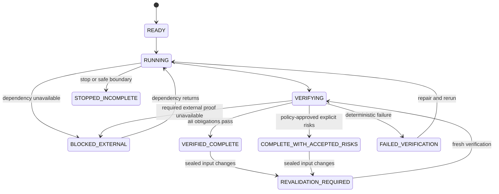

`IMPLEMENTED != VERIFIED` because implementation is a claim about source or
work, while verification is a claim about the relationship between a sealed
requirement and independently collected evidence. The distinction protects
against false positives from partial code, incorrect project scope, skipped
tests, stale artifacts, and “green” output that did not test the criterion.

---

## 6. Complete mission lifecycle

### 6.1 End-to-end sequence

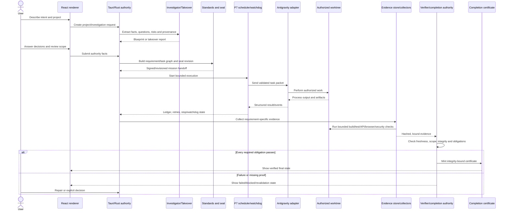

### 6.2 Stage-by-stage explanation

1. **Intent:** the user describes an outcome, not necessarily a technical plan.
2. **Project identity:** the desktop persists a project and its local path.
3. **Investigation:** the P4 investigator asks questions, records provenance,
   assumptions, risks, journeys and architecture decisions. P5 takeover can
   scan an existing repository read-only.
4. **Applicability:** the P6 standards engine evaluates domain facts against a
   signed production registry. `NeedsDecision` and unknown facts remain visible.
5. **Requirement graph:** applicable rules and project seeds become requirements
   with acceptance criteria, evidence obligations and dependencies.
6. **Seal:** a mission revision contains the contract hash, scope and sealed
   requirement/task graph. A later change requires a new revision or revalidation.
7. **Execution:** P7 schedules tasks with leases, budgets, retries, dependency
   order, watchdog conditions and a durable ledger. The authoritative
   `ExecutionTimePolicy` sets the Closed-Beta task and lease window to 600,000
   ms, with a separate 900,000 ms adapter safety ceiling; the effective
   deadline is the earliest sealed task, lease or adapter boundary and is never
   extended after launch.
8. **Adapter work:** an Antigravity-compatible adapter is the intended worker
   boundary. Current source provides structured safety primitives, but P12 says
   production signed plugin installation/hooks/headless integration are not
   release-complete.
9. **Evidence:** collectors run requirement-specific commands and observations,
   bound to criterion and collector identities, exact P7 run/task/attempt/lease
   and process-result identities, pre/post workspace attribution, bounded
   output and authenticated content hashes.
10. **Verification:** P8 evaluates every obligation, not just the last output.
11. **Recovery:** drift, interruption, stale evidence or failed checks create a
   safe repair/revalidation path rather than silently continuing.
12. **Certificate:** only the completion authority can issue the final artifact.

### 6.3 Example: “Fix login and prove authentication works”

The user statement might become requirements such as:

- Login accepts the supported identity flow.
- The callback validates state and PKCE.
- A cloud session is issued only after server-side identity validation.
- A signed-out session cannot call authenticated account data.
- Logout removes the local session and is rejected by protected calls.
- A deterministic test and a real integration result cover the required path.

Success means each applicable criterion receives the evidence class it requires.
A source diff plus a passing unit test may prove a local parser rule, but it
does not prove that Google, the cloud database and the installed desktop work
together. If the real integration is unavailable, the mission remains blocked
or unverified instead of being declared complete.

---

## 7. Antigravity integration

### 7.1 Current architecture

Relintor is Antigravity-first in its intended execution strategy, but the
boundary is deliberately adapter-shaped rather than GUI-click-shaped. The
compatibility registry lists `agy` and `agy.exe` as official CLI candidate names
and supports only a `1.` version prefix in the current registry. Detection looks
for an explicit `ANTIGRAVITY_PATH` override, then candidate names in the process
`PATH`. It can record a resolved executable and version output.

The core detection result includes:

- status and platform;
- resolved executable path;
- version text if the executable responds;
- CLI invocation capability;
- plugin/hook capability;
- compatibility classification;
- detection timestamp and detail.

The `relintor-antigravity` crate additionally defines task packets, stop
conditions, bounded output, process identity, normalized events, bridge
manifests, hook messages, permission decisions, and adapter traits. These are
important safety boundaries, not proof that an installed production plugin
exists.

### 7.2 What is proven versus not proven

| Capability | Current status |
|---|---|
| Executable discovery without a fixed developer-PC path | `IMPLEMENTED / DETERMINISTICALLY TESTED`; live installed Antigravity discovery is environment-dependent. |
| Version/CLI probing | `IMPLEMENTED / NOT LIVE VERIFIED` for a real supported installation. |
| Supported version registry | `IMPLEMENTED`; current registry contains `1.` prefix and hook capability metadata. |
| Structured task packet and process limits | `IMPLEMENTED / LOCALLY VERIFIED`. |
| Safe path and command validation | `IMPLEMENTED / LOCALLY VERIFIED`. |
| Signed production bridge identity | `PARTIALLY IMPLEMENTED`; manifest requires an external digest/signing identity and contains no bridge binary/key. |
| Production plugin install and hooks | `FUTURE / RELEASE-STOPPING GAP` according to P12 F-01..F-12 audit. |
| Real headless Antigravity execution | `IMPLEMENTED / NOT LIVE VERIFIED` at the full product boundary. |
| GUI-click automation as foundation | `OUT OF CURRENT ARCHITECTURE`; structured adapter/CLI is the intended boundary. |

### 7.3 Missing behavior is not faked

If Antigravity is missing or compatibility is unknown, the correct result is
unavailable/blocked. The desktop health model does not turn an executable's
presence into compatibility proof. The bridge installer refuses unsigned or
digest-incomplete packages. A `MockAdapter` exists for deterministic test
support, but P12 explicitly says it cannot substitute for production evidence.

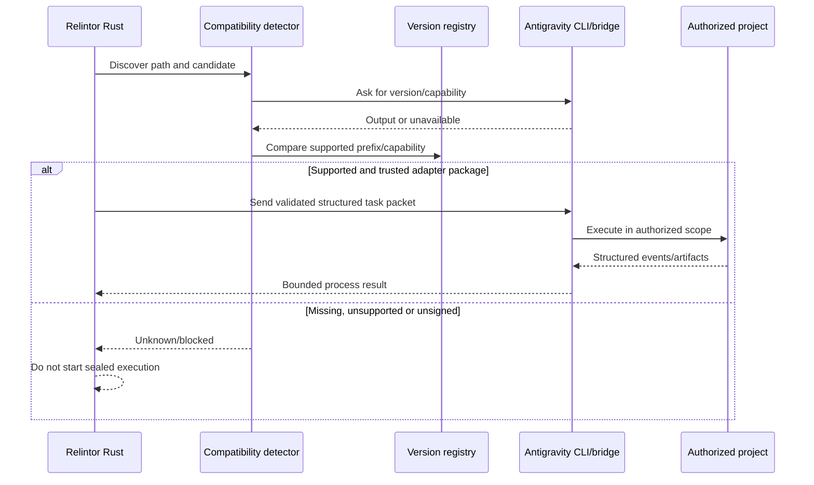

---

## 8. Desktop application anatomy

### 8.1 Layers

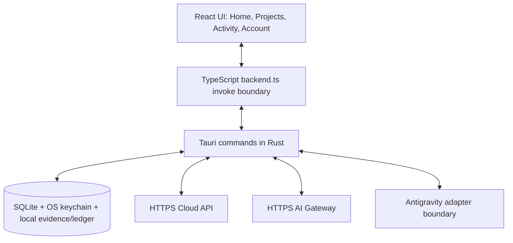

The desktop is a Tauri application with a React renderer and a Rust native
library/binary. The frontend route model currently exposes exactly four primary
destinations: `home`, `projects`, `activity`, and `account`.

### 8.2 Current visible areas

| Area | Current source-backed function |
|---|---|
| Home | Onboarding, project creation/takeover entry points, principles and recent/project state. |
| Projects | Investigation answers, takeover scan, authority facts, applicable standards, requirement preview and mission sealing. |
| Activity | Execution status, watchdog state, events, blockers, safe boundaries and recovery information. |
| Account | Health panels, Google sign-in/sign-out, account/entitlement summary, privacy/support explanation and organization/account messaging. |
| Verification panels | Requirement counts, missing/failed/skipped/stale/blocked evidence, certificate and export actions within the project flow. |

The existing full approved logo is used by the renderer. The native window title
is `Relintor Beta`; the internal identifier remains `com.relintor.desktop`.

### 8.3 Renderer/backend trust boundary

The TypeScript bridge returns browser-preview placeholders when the native
process is absent, but those placeholders say that Rust authority, local DB,
spec verification, Antigravity detection, execution and certificates are
unavailable. The browser preview cannot seal, execute, or fabricate evidence.

Google session tokens are retained in Rust memory and are not returned to the
renderer. The renderer receives an account state summary. Public desktop
configuration uses compile-time public defaults with optional runtime overrides;
server-side secrets are not embedded in the desktop.

### 8.4 Windows compatibility boundary

The Tauri configuration contains repository-relative paths, public compile-time
configuration and generated icon assets. It does not select a machine path or
hard-code x64 in the package configuration. The intended target families are
MSVC x64 and ARM64, subject to the actual Tauri/Rust/dependency support of the
release toolchain. Local x64 MSVC build evidence is not an ARM64 build result.

---

## 9. Local-first data model

### 9.1 Local/cloud split

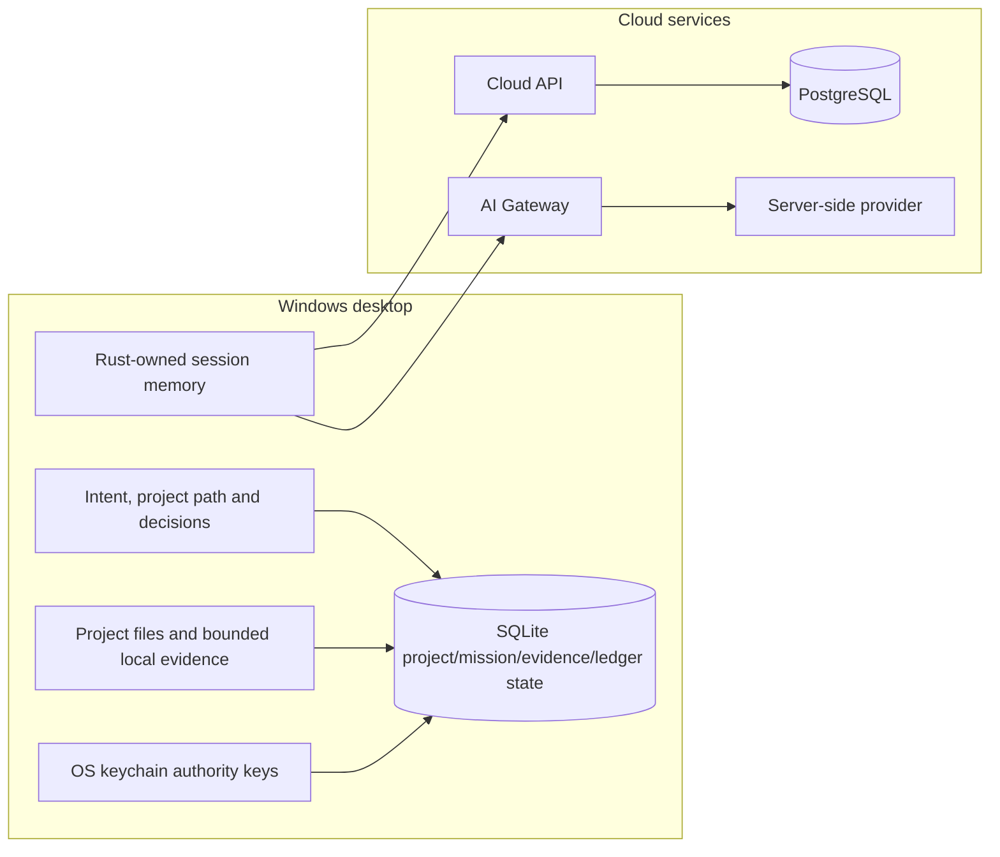

### 9.2 What belongs locally

Local state includes project identity and path, investigator/takeover material,
sealed authority revisions, execution ledgers, recovery checkpoints, evidence
artifacts, workspace fingerprints, local health results, and OS-keychain-backed
authority keys. Project content should remain local unless an authorized,
bounded evidence workflow requires a specific handoff. The evidence model is
designed around minimized context, hashes, classes, provenance and bounded
output rather than unrestricted project upload.

### 9.3 What belongs in cloud PostgreSQL

The PostgreSQL migrations define users, organizations, memberships, devices,
sessions, plans, entitlements, grants, audit events, usage buckets,
complimentary grants, admin actions, subscriptions, admin identities, MFA
challenges/proofs, P10 admin audit events, and Google external identities.
Cloud state is account/organization/entitlement authority; it is not a
replacement for the local mission/evidence ledger.

### 9.4 Important durable entities

| Entity | Store | Purpose |
|---|---|---|
| Project | SQLite | Local project identity and root path. |
| Mission revision/contract/seal | SQLite through standards persistence | Immutable revision-scoped requirement/task authority. |
| Requirement/criterion | Sealed mission state | Obligation and proof boundary. |
| Execution run/attempt/event | SQLite ledger | Bounded work scheduling and watchdog history. |
| Evidence artifact/envelope | Local evidence store | Integrity-bound proof and invalidation. |
| User/organization/membership | PostgreSQL | Cloud identity and tenant relationship. |
| Device/session | PostgreSQL, token material retained safely | Access/refresh session rotation and device association. |
| Entitlement/plan/grant/usage | PostgreSQL | Server-side access policy and accounting. |
| External identity | PostgreSQL | Google `sub` authority mapped to a Relintor user. |

The live PostgreSQL integration test is ignored unless a disposable
`RELINTOR_TEST_DATABASE_URL` is supplied. The current record therefore does not
claim that PostgreSQL migrations have executed in this environment.

### 9.5 ER-style cloud model

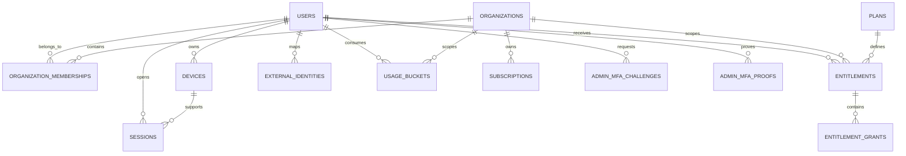

---

## 10. Cloud API

### 10.1 Responsibility

`services/cloud-api` is the server-side identity, tenant, entitlement and
administration authority. It supports a memory store for deterministic tests
and a PostgreSQL store for real cloud state. The service applies migrations,
validates bearer sessions, issues/rotates sessions, maps Google identities,
retrieves entitlement policy and signs entitlement documents.

### 10.2 Safe endpoint families visible in source

The current route dispatch contains these public families. The exact deployment
host is configuration, not a permanent property of this document:

| Method/family | Purpose | Authentication/status |
|---|---|---|
| `GET /healthz` | Liveness/health response | Public health surface. |
| `GET /readyz` | Repository-backed readiness | Must reflect the configured repository/database state. |
| `GET /v1/standards/distribution` | Standards distribution response | Cloud route for distribution metadata. |
| `POST /v1/auth/dev/sign-in` | Explicit development adapter | Disabled outside development. |
| `POST /v1/auth/google/exchange` | Exchange validated Google ID token for Relintor session | Enabled only with `google_oidc`. |
| `POST /v1/auth/sign-out` | Revoke/sign out session | Authenticated. |
| `POST /v1/auth/refresh` | Rotate refresh session | Refresh token required and rotated. |
| `GET /v1/account` | Current authenticated account | Access bearer required. |
| `GET /v1/entitlements` | Current entitlement policy/document | Access bearer required; server signs the result. |
| `POST /v1/devices/register` | Register a device | Authenticated. |
| `/v1/organizations/*` | Members and team policy | Organization role/tenant checks. |
| `/v1/billing/status` | Billing/subscription status | Authenticated organization/account scope. |
| `/v1/admin/*` | MFA, grants, audit and admin operations | Admin/founder role plus fresh session-bound MFA where required. |

### 10.3 Session and entitlement behavior

Cloud sessions are associated with user/device/organization state. Access and
refresh material is hashed/persisted as appropriate; refresh rotation rejects
reuse. The entitlement policy is server-derived. Signed entitlement claims use
shared contracts and verification helpers; a desktop client does not invent
plan or grant authority.

The P10 code contains role, founder, organization scoping, seat, grant,
subscription, usage and MFA checks. The admin UI is a client of those routes,
not a second authority implementation.

### 10.4 Cloud status labels

The current implementation is locally well tested, but the canonical P12 report
keeps `P2_LIVE_POSTGRES_INTEGRATION=PENDING_EXTERNAL_ENVIRONMENT` and
`P10_LIVE_POSTGRES_INTEGRATION=PENDING_EXTERNAL_ENVIRONMENT`. This means the
source and memory-store tests are evidence of behavior, while a real disposable
PostgreSQL round trip is a separate required gate.

---

## 11. Google authentication flow

### 11.1 Flow

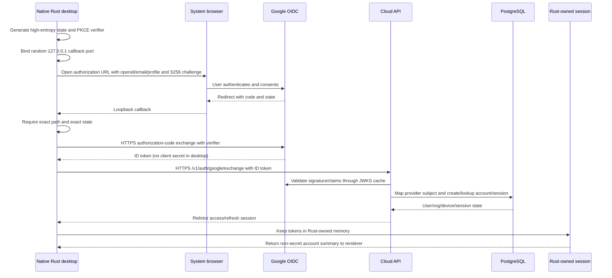

### 11.2 Security properties

- The browser flow uses authorization code plus PKCE S256, not a pasted code.
- `state` is random and must match exactly on the loopback callback.
- The callback is bound to `127.0.0.1` on a random port and has a bounded wait.
- The desktop uses public client configuration and does not contain a Google
  client secret.
- The cloud validator verifies Google JWKS signature, issuer, audience, expiry,
  subject and verified-email conditions. The stable authority key is Google
  `sub`, not a mutable email address.
- Migration 010 adds the `external_identities` table without rewriting earlier
  migrations.
- The renderer receives an account summary, not access or refresh tokens.

### 11.3 Verification status

Deterministic PKCE, callback, claim and mocked-JWKS tests exist and have passed
locally. A real Google login with production credentials was not executed in
the documented gate, so `REAL GOOGLE DESKTOP LOGIN NOT YET VERIFIED` remains the
truthful statement. No credential or token is printed here.

---

## 12. AI Gateway

### 12.1 Authority chain

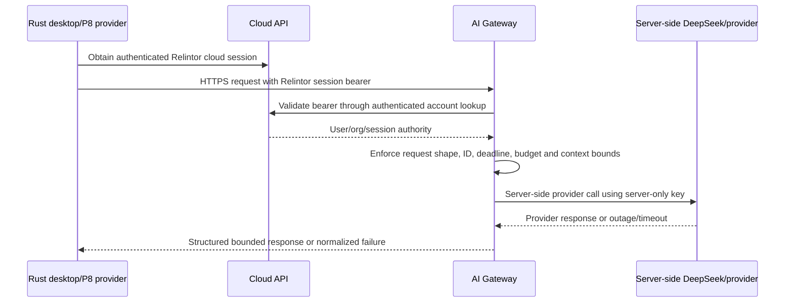

The desktop does not ask users for DeepSeek/provider API keys. The provider key
belongs only in server-side service configuration. Production desktop P8 uses
the authenticated Relintor cloud session access token retained in Rust; the
development bearer adapter is explicit development-only behavior.

### 12.2 Gateway defenses

The source and local tests cover bearer validation, non-mock configuration,
provider timeout/deadline normalization, outage behavior, request-ID/body
hardening, usage budgets, secret redaction and structured response parsing.
The AI gateway cannot elevate a provider response directly into completion; the
evidence engine must authenticate and bind the resulting judgement.

### 12.3 Remaining gate

`P8_REAL_INDEPENDENT_AI_VERIFIER=PENDING_EXTERNAL_ENVIRONMENT` remains in the
current ledger. Local structured tests do not prove that the configured real
DeepSeek endpoint is reachable, correctly provisioned, or suitable for release.

---

## 13. Evidence system

### 13.1 Evidence classes

The standards model defines classes including source diff, file hash, build
output, test output, lint/static analysis, API response, database query,
browser recording, screenshot, accessibility result, performance result,
security scan, deployment probe, external-service receipt, human decision, AI
judgement and environment fingerprint.

Evidence is useful only when its identity and scope are clear. A collector
receipt records the collector identity/version and the result is stored through
the evidence store with digests and integrity material.

### 13.2 Strong and weak evidence

| Evidence | Strength and boundary |
|---|---|
| Agent says “passed” | Weak. It is an assertion without an independently captured command, scope, exit status or binding. |
| Source diff | Can show an implementation change, not that behavior works. |
| Build output | Shows a particular build command succeeded in a particular environment; it does not prove runtime behavior or every requirement. |
| Test output | Strong for the executed test's actual scope and result; cannot prove tests that were skipped or unrelated. |
| API/database observation | Stronger runtime evidence when it is real, authenticated, scoped and recorded; a mock response is not PostgreSQL proof. |
| Browser recording | Proves an observed UI path in the tested environment; it does not prove native or cross-platform behavior. |
| Screenshot | Useful context, but insufficient for hidden state, cryptography or server authority by itself. |
| External service receipt | Necessary for Google/provider/PostgreSQL/Antigravity live gates; must be real and identifiable. |
| Completion certificate | A final artifact produced only after the verifier accepts all required evidence; it is not a substitute for its inputs. |

### 13.3 Evidence invalidation

Workspace fingerprints, source/lock/environment identities and authority
revisions are used to make stale evidence visible. A same-size file change can
invalidate a full-file hash because hashing is streamed over file contents.
Evidence artifacts are not a permanent permission to claim completion after the
project, lockfile, environment or sealed requirement changes.

---

## 14. Verification system

### 14.1 Verification decision flow

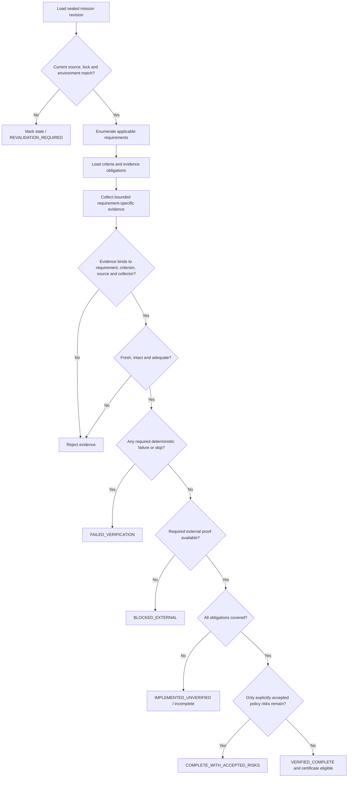

### 14.2 Independent verification

The evidence engine checks that a report is complete and consistent, rejects
missing/failed/skipped evidence, protects criterion-to-command bindings,
validates integrity, and prevents a mutable report from minting a certificate.
The P8 test corpus is strong local adversarial evidence, but it is not a claim
that a full real-world false-done benchmark has been executed.

### 14.3 Unavailable dependencies

Unavailable PostgreSQL, live Google, provider, Antigravity, macOS, Linux,
signing, clean-machine or usability environments are recorded as external
blocks/not-run gates. The verifier must not convert them to green evidence.

---

## 15. Recovery and repair loop

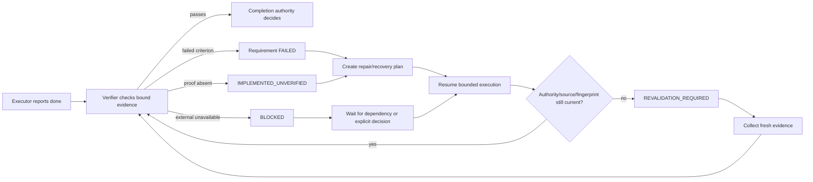

P7 recovery records checkpoints, safe boundaries, session interruption,
external modification and watchdog conditions. A continuation is not a magic
“try again”; it must be authenticated against the applicable mission revision,
workspace fingerprint and execution identity. When a source or authority input
changes, old proof is stale.

---

## 16. Security model

### 16.1 Core principles

1. **Renderer distrust:** UI values are requests, not authority.
2. **Least privilege:** Commands are scoped to an operation, project and
   authority context.
3. **Fail closed:** Missing configuration, unsupported adapters, invalid tokens,
   stale evidence and unavailable services produce explicit non-pass states.
4. **Server-side secrets:** Provider API keys, database credentials, signing
   keys and development bearer values must not be in desktop, renderer,
   installer, logs or documentation.
5. **Cryptographic binding:** Sessions, entitlements, seals, evidence and
   recovery records use hashes/signatures/HMACs where the source requires it.
6. **Bounded I/O:** Process output, request bodies, provider responses and
   imported repository scans have limits.
7. **Tenant isolation:** Cloud routes enforce user, organization, role, MFA and
   session scope in the service.

### 16.2 Threat table

| Threat | Attack | Existing defense | Remaining risk/status |
|---|---|---|---|
| Renderer forges completion | Modify UI or invoke a fake status | Completion is Rust/evidence authority; renderer receives summaries | Native runtime and user environment still need release testing. |
| Executor lies “done” | Free-form claim replaces proof | Requirement-specific evidence and certificate rules | Real Antigravity production adapter still incomplete. |
| Stale evidence reused | Change source without rerunning checks | Workspace/environment/authority fingerprints and invalidation | External build/release workflows must preserve the same discipline. |
| Same-size file change | Preserve file size while changing bytes | Streamed full-file hashes | Hash coverage must remain correct for every new collector. |
| Path escape | Symlink/junction or traversal leaves workspace | Canonical path/sandbox validation and P9 checks | Windows symlink/reparse smoke is not universally run. |
| Arbitrary bearer | Send any string to AI/cloud | Cloud session lookup and fail-closed auth | Real cloud deployment still needs live integration proof. |
| Provider key leak | Put key in desktop/logs/request | Gateway owns provider adapter; secret scans | Operational server configuration and rotation remain deployment work. |
| Google token forgery | Fake issuer/audience/signature | JWKS RS256, issuer/audience/expiry/sub/email checks | Live Google authorization not run in the current evidence. |
| Cross-tenant admin action | Reuse user/org identifiers | Server role, tenant, MFA and audit checks | Real PostgreSQL/admin environment remains external. |
| Refresh replay | Reuse rotated refresh token | Hashed sessions and rotation/reuse rejection | Live session store test pending. |
| Dependency outage | Treat unavailable service as pass | Explicit blocked/unavailable states and bounded timeouts | Product UX for every outage needs broader live usability testing. |
| Update tampering | Install unsigned/replayed artifact | Distribution crate has signed-manifest verification primitives | Integrated updater path A-08 is not complete. |
| Uninstall data loss | Remove evidence unexpectedly | Export/preserve primitives exist | Required product uninstall/export flow A-12 is not integrated. |
| Lock/spec tampering | Remove requirements silently | Locked manifest/hash verifier and acceptance tests | Documentation must never redefine locked requirements. |

### 16.3 Logging and artifacts

Logs and support snapshots may include health words, IDs, paths or bounded
status, but must not include bearer tokens, provider keys, database passwords,
private signing material, Google client secrets or raw project content outside
the authorized evidence contract. Secret scan is a pattern gate, not a proof
that every future secret class is impossible.

---

## 17. The locked specification

`spec/locked` is the repository's immutable product/specification boundary. It
contains the product constitution, UX/UI, architecture, Antigravity contract,
investigation/standards, evidence graph, execution/recovery, subscriptions,
feature register, phases, verification/release gates, positioning and brand.

The verifier reports 18 locked files, 17 manifest entries and 144 unique feature
IDs. `spec/LOCKED_MANIFEST.sha256` and the manifest JSON protect the expected
content. `relintor-core` exposes specification health and checks the locked
content against its pin. `tooling/spec/verify_spec.py` also checks structure,
feature uniqueness and mutation behavior through the acceptance test.

The practical rule is:

- source changes implement or correct behavior against the spec;
- evidence reports explain what was actually proven;
- documentation explains the current state;
- none of those may silently rewrite a locked requirement.

---

## 18. Testing system

### 18.1 Test classes

| Test class | Current repository evidence | Proves | Does not prove |
|---|---|---|---|
| Rust unit tests | Embedded in the 12 workspace members | Pure logic, memory stores, policy and helper behavior | Full external deployment. |
| Rust integration tests | 19 `.rs` files under crate `tests/` | Adversarial P4–P9/P12 acceptance, evidence and release guards | Real Antigravity, real Google, or all platform runtimes. |
| Cargo workspace tests | P12: 263 passed, 0 failed, 2 ignored | Broad local Rust regression | Ignored PostgreSQL integration. |
| `cargo fmt` | Local PASS | Formatting consistency | Behavior. |
| `cargo clippy -D warnings` | Local PASS | Lint/static quality | Runtime correctness. |
| Frontend tests | Three test files; P12 records desktop 10, admin 6, website 2 | Renderer interactions in test DOM | Native Tauri, real browser OAuth, cloud. |
| Typecheck | Each app has TypeScript script | Type compatibility | Runtime server responses. |
| Lint | Each app has ESLint script | Static frontend quality | Product acceptance. |
| Build | Each app has Vite build script | Bundle generation | Clean-machine install. |
| Spec verifier | `tooling/spec/verify_spec.py` | Locked manifest/features/IDs | Implementation truth. |
| Traceability verifier | `verify_traceability.py` | Record structure/status references | Live behavior. |
| Secret scan | `secret_scan.py` | Known provider/private-key/connection pattern absence | Unknown/custom secrets not matching patterns. |
| Gitleaks | P12 recorded all required scopes PASS | Broad secret pattern scan | Runtime correctness. |
| Live PostgreSQL test | Ignored without URL | Real migration/account/session round trip when run | No evidence when not run. |
| Packaging/native build | Local x64 MSVC native/NSIS evidence in P12 | Build configuration and artifact generation | Signed clean install, upgrade, uninstall or ARM64. |

### 18.2 Test-count discipline

Counts in this document are either calculated from filenames or copied from a
canonical command ledger. A test-file count is never presented as a passing
test count. An ignored test is never counted as a pass.

---

## 19. Windows build and release anatomy

### 19.1 Developer machine versus end user

| Developer/build requirement | End-user requirement |
|---|---|
| Rust 1.96/MSVC toolchain, Cargo and rustfmt/clippy | None of Rust/Cargo is required for normal use. |
| Node/pnpm and frozen workspace dependencies | No Node/pnpm is required after installation. |
| Visual Studio C++ Build Tools/MSVC linker | No Visual Studio Build Tools is required for the installed app. |
| Tauri CLI and frontend build | No Tauri CLI is required. |
| Optional PostgreSQL/Google/provider/Antigravity test services | No database or provider key should be installed for normal desktop use. |
| D-first temporary/build directories on this development machine | No D: path, WSL path, or developer environment variable is required. |

### 19.2 Windows targets

The intended release matrix includes:

- `x86_64-pc-windows-msvc` for common Intel/AMD 64-bit Windows systems;
- `aarch64-pc-windows-msvc` for supported Windows-on-ARM systems.

The Tauri configuration uses relative paths and contains no target-specific
absolute directory. The current local evidence is x64 MSVC only. ARM64 must be
compiled and tested in its own compatible build environment before being
advertised as a shipped package.

### 19.3 Native shell and icons

The native icon source is derived from the approved Relintor logo. The full
wordmark remains a UI/web asset; the native icon is the cropped symbol-only
mark. Tauri bundle paths refer to repository-relative PNG/ICO/ICNS assets. The
window title is `Relintor Beta`; the identifier is unchanged.

### 19.4 Packaging status

The Tauri/NSIS build path has local x64 evidence in the P12 report, but the
current release record still says:

- production code signing/notarization: not certified;
- clean install/upgrade/uninstall: not run in an isolated disposable release
  environment;
- updater/rollback product path: A-08 implementation gap;
- uninstall/export/preserve product path: A-12 implementation gap;
- hosted macOS/Linux: deferred;
- ARM64: configuration-neutral, actual package gate pending.

---

## 20. Deployment topology

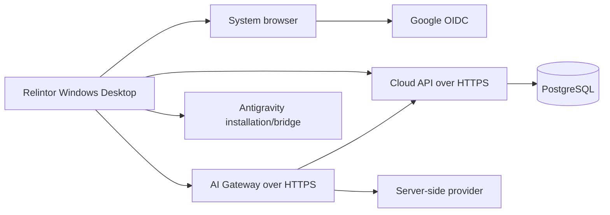

The exact public service hosts are deployment configuration and may be
temporary tunnel infrastructure; they are not architectural identity. The
cloud database, provider key and bridge signing key are server/release concerns
and must not be placed in the desktop bundle.

---

## 21. Configuration inventory

Only names are listed here. Values, credentials and tokens are intentionally
omitted.

### 21.1 Public desktop configuration

| Name | Location/use | Secret? |
|---|---|---|
| `RELINTOR_CLOUD_API_ENDPOINT` | Desktop public cloud endpoint; compile-time default with runtime override | No, but must be validated and HTTPS in production. |
| `RELINTOR_GOOGLE_CLIENT_ID` | Desktop public OAuth client ID | No; a client secret must not be added. |
| `RELINTOR_AI_GATEWAY_ENDPOINT` | Desktop public gateway endpoint | No, but must be validated and HTTPS in production. |

### 21.2 Server-side and development secret names

| Name/category | Where it belongs | Must never be placed in |
|---|---|---|
| `RELINTOR_PROVIDER_API_KEY` | AI Gateway service environment | Desktop source, renderer, installer, logs or docs. |
| `RELINTOR_AI_DEV_BEARER_TOKEN` | Explicit AI Gateway development mode | Production desktop or public bundle. |
| Database URL/credentials | Cloud API service environment/test environment | Desktop source, renderer or docs. |
| Entitlement/signing/private keys | Cloud/release secret store | Repository, desktop, renderer or installer. |
| Google client secret | Server-side OAuth deployment only if applicable | Desktop; desktop flow is public-client PKCE. |

### 21.3 Build/configuration names

`RUSTUP_HOME`, `CARGO_HOME`, `CARGO_TARGET_DIR`, `TEMP`, `TMP`, MSVC
developer-environment variables, Tauri CLI options and pnpm store locations
are developer/build concerns, not product runtime configuration. The current
documentation intentionally does not preserve machine-specific values.

---

## 22. Error and failure model

| Situation | Correct product behavior |
|---|---|
| Internet unavailable | Show offline/unavailable; do not fabricate cloud, provider or external evidence. Local work can remain local where the operation permits. |
| Cloud API unavailable | Sign-in/account/entitlement operations fail closed; existing local state must not be upgraded to a fresh cloud pass. |
| AI unavailable | AI verifier is unavailable/pending; deterministic verification remains authoritative and no mock result is promoted. |
| Google login fails/cancels | Show a truthful failure/cancel state; do not accept pasted tokens or arbitrary bearer values. |
| Antigravity missing | Show not installed/unknown and guide the user or support path; do not start unsupported sealed execution. |
| Antigravity execution fails | Record process/failure evidence, stop/retry according to policy, and leave the requirement unverified/failed. |
| Tests fail | Preserve the failed result; a different passing test cannot erase a required deterministic failure. |
| Evidence insufficient | `IMPLEMENTED_UNVERIFIED`, incomplete or blocked as appropriate. |
| Verifier fails | `FAILED_VERIFICATION` or `REVALIDATION_REQUIRED`; certificate is not issued. |
| Database unavailable | Cloud readiness/session/entitlement path reports unavailable; no fake PostgreSQL readiness. |
| Project path invalid | Reject before scan/execute; never widen scope silently. |
| Requirement blocked | Record the external/policy blocker; distinguish `BLOCKED` from deterministic `FAILED`. |
| Sealed input changed | Invalidate stale proof and require revalidation. |

`FAILED` means an executed deterministic check produced a negative result.
`BLOCKED` means required work/proof could not execute because of an external or
policy condition. `REVALIDATION_REQUIRED` means prior authority/evidence became
stale after an input changed. These meanings must not be collapsed for a green
dashboard.

---

## 23. Release gates

### 23.1 Full sealed release equation

Relintor's release logic is not “the binary built.” A truthful full release
requires, at minimum, a compatible sealed specification/traceability state,
passing deterministic source/build/test/security gates, valid evidence and
completion authority, real required external integrations, signed release
artifacts, clean-machine install/upgrade/uninstall, and platform-specific
verification.

```text
FULL SEALED RELEASE
= sealed spec and traceability
  + deterministic local gates
  + requirement-specific evidence
  + completion authority/certificate
  + real external gates
  + signed distribution/update/uninstall paths
  + required platform and clean-machine gates
```

### 23.2 Windows closed-beta readiness

The Windows beta can have strong local implementation/build readiness without
being a full certified release. The current record supports local x64 MSVC
quality/build evidence and public configuration/icon wiring, but it does not
erase the P12 release-stopping gaps or external gates. An engineer must not
rename `NOT_RUN`, `PENDING_EXTERNAL_ENVIRONMENT`, or `REVALIDATION_REQUIRED`
to PASS simply because a local build is green.

### 23.3 Current release blockers

The canonical P12 report identifies:

- A-08: automatic signed updates are not integrated as the supported product
  path;
- A-12: uninstall/export/preserve choice is not integrated as the required
  product path;
- F-01..F-12: production signed Antigravity plugin/adapter installation,
  hooks, headless execution, action binding, leases, capture and compatibility
  certification are not complete;
- live PostgreSQL, provider, Antigravity, cross-platform, clean-machine,
  signing, rollout and non-expert usability gates remain external/not run.

---

## 24. Design decision register

| Decision | Reason | Rejected/limited alternative | Consequence | Reconsider when |
|---|---|---|---|---|
| Local-first project/evidence state | Keeps sensitive project material under local authority and makes offline/local inspection possible | Upload every project to cloud | Cloud cannot automatically see all local facts; evidence handoff must be bounded | Product adds a reviewed remote evidence mode. |
| Tauri shell with Rust authority | Native filesystem/keychain/process access with a web UI | Renderer-only web app | Two-language trust boundary must be maintained | A different native host offers equal authority and security. |
| React renderer | Familiar component UI and existing tests | Native-only UI | Renderer is presentation/request layer, never authority | Product platform strategy changes. |
| SQLite local store | Durable local project and ledger state | Cloud-only storage | Must handle migrations and local corruption/backup carefully | Multi-device local sync is designed and verified. |
| PostgreSQL cloud store | Relational tenant/session/entitlement consistency | Unstructured cloud documents | Live migrations and tenant tests are necessary | Deployment scale or service ownership changes. |
| Antigravity-first adapter | Structured execution protocol and existing official runtime relationship | GUI click automation | Production bridge/signing integration remains a release gate | Supported official protocol changes. |
| No GUI-click automation foundation | Clicks are brittle and hard to bind to authority | Treat desktop clicks as execution API | Requires CLI/bridge compatibility work | Official integration offers a stable structured GUI API. |
| Server-side provider keys | Users should not carry or reveal AI provider credentials | Ask every user for a key | Gateway availability is an external dependency | A formally designed user-owned key mode is threat-modeled. |
| System-browser OAuth + PKCE | Avoids embedding client secret and uses platform browser security | Pasted auth code or embedded password form | Requires loopback timeout/callback handling | Provider publishes a different secure desktop flow. |
| Independent verifier | Separates worker claims from proof | Trust executor transcript | More evidence collection and state complexity | Never remove; only refine policy. |
| Immutable locked spec | Prevents silent requirement deletion/redefinition | Edit requirements during implementation | Requires new revision/phase for product changes | A governed spec-release process changes the pin. |
| Fail closed | Avoids false green state under uncertainty | Best-effort pass | Users see blocked/pending states and need recovery paths | Only a formally stronger proof boundary could replace it. |
| Windows beta first | Concentrates initial native validation | Claim all platforms from one runner | macOS/Linux/ARM64 need their own gates | Hosted/platform runs complete. |

---

## 25. Engineer handoff checklist

### Repository and local setup

- [ ] Read this anatomy and the user/admin manual.
- [ ] Read the relevant locked specification file before changing behavior.
- [ ] Identify the owning crate/service before editing.
- [ ] Keep `spec/locked`, `pnpm-lock.yaml` and `Cargo.lock` preservation rules in view.
- [ ] Use D-first build/temp paths on this development machine without hard-coding them into product code.
- [ ] Do not read or print secret values.

### Authority and security

- [ ] Treat renderer input as untrusted requests.
- [ ] Keep provider, database, signing and OAuth secrets server-side.
- [ ] Bind new evidence to requirement and criterion IDs.
- [ ] Add invalidation/freshness behavior for new source/environment inputs.
- [ ] Define explicit unavailable/failure/block states.
- [ ] Add adversarial tests for forged success, scope escape and stale evidence.

### Auth/cloud

- [ ] Preserve Google browser/PKCE/state/loopback properties.
- [ ] Use stable Google subject identity, not email as authority.
- [ ] Keep session/refresh rotation server-authoritative.
- [ ] Test tenant, role, MFA, entitlement, usage and replay boundaries.
- [ ] Mark live PostgreSQL/provider/Google results separately from mocks.

### Desktop and UI

- [ ] Add a Rust command only when the operation has a defined authority boundary.
- [ ] Return summaries, not tokens or private keys, to TypeScript.
- [ ] Make browser preview truthfully unavailable for native-only operations.
- [ ] Keep UI status text consistent with backend state.
- [ ] Preserve full approved branding and native icon/title conventions.

### Antigravity/execution

- [ ] Validate executable, version, bridge identity, packet, path and scope.
- [ ] Do not use `MockAdapter` as production evidence.
- [ ] Use bounded process output and explicit stop conditions.
- [ ] Keep task completion separate from requirement verification.
- [ ] Test retry, budget, dependency, no-progress, drift and recovery states.

### Database, evidence and release

- [ ] Additive migration only; never rewrite applied migration history.
- [ ] Correlate migrations with actual schema objects.
- [ ] Add deterministic unit/integration tests and a live gate when required.
- [ ] Run fmt, clippy, tests, typecheck, lint, build, spec, traceability and secret gates.
- [ ] Run platform/clean-machine/signing gates before claiming a release.
- [ ] Update documentation only after the implementation/evidence state is clear.

---

## 26. Example: adding a new evidence type

This is a design example, not an implemented feature.

### Feature request

“Add a `ContainerScan` evidence type proving that the built application image
contains no critical vulnerabilities.”

### Required sequence

1. **Start at the contract:** inspect `EvidenceClass`, collector identity,
   obligation policy, report serialization, traceability and locked spec.
2. **Make an architecture decision:** decide whether the scan is local-only,
   CI-only, or both. Define the image identity and scanner version as part of
   evidence, not as free text.
3. **Check spec implications:** if this changes a locked requirement, do not edit
   `spec/locked` in place. Use the governed specification/revision process.
4. **Add a structured observation:** include image digest, scanner identity,
   severity counts, exit code, bounded output digest and timestamp.
5. **Bind it:** require a `requirement_id`, `criterion_id`, collector identity,
   command digest, workspace/environment context and evidence class.
6. **Add invalidation:** changing the image digest, scanner version, policy or
   target environment must invalidate the artifact.
7. **Add tests:** cover passing scan, critical finding, malformed output,
   timeout, scope mismatch, stale fingerprint, forged status and oversized output.
8. **Add UI summary:** expose status/counts only through Rust-backed response;
   never let the renderer decide that zero displayed findings means pass.
9. **Run gates:** fmt, clippy, Rust tests, frontend tests/build, spec,
   traceability, secret scan and any real scanner integration gate.
10. **Document:** update the technical anatomy, user/admin manual and release
    evidence with exact status labels and a “does not prove” statement.

### What must not happen

- Do not accept a screenshot or agent sentence as the scan result.
- Do not run an imported project/image in place without a disposable boundary.
- Do not add a provider or registry secret to the desktop.
- Do not mark a requirement `VERIFIED` because the scanner process returned 0
  unless the output was bound to the right image and policy.
- Do not silently add a new locked requirement by editing the spec file.

---

## 27. What Relintor is not

- Not merely a chat wrapper around an AI model.
- Not an ordinary IDE that treats a coding assistant's text as truth.
- Not an executor that can self-certify its own work.
- Not a generator of “100% done” claims without criterion-specific proof.
- Not a product that asks users to carry provider API keys for normal use.
- Not a cloud-only upload system for all project source by default.
- Not a guarantee that `VERIFIED_COMPLETE` means mathematically perfect or
  bug-free software.
- Not a silent pass when Google, PostgreSQL, Antigravity, a provider or a
  platform runner is unavailable.
- Not currently a fully certified signed updater/uninstaller/plugin ecosystem.
- Not yet a claim that macOS/Linux/ARM64 runtime and packaging gates passed.

---

## 28. Current technical status

| Capability | Current status | Evidence/qualification |
|---|---|---|
| Locked specification and 144 feature IDs | `VERIFIED` structurally | Spec verifier reports 18 files, 17 manifest entries, 144 unique IDs. |
| Rust workspace compile/lint/tests | `VERIFIED` locally | P12 records 263 passed, 0 failed, 2 ignored. |
| Desktop UI/typecheck/lint/tests/build | `VERIFIED` locally | P12 records desktop frontend gates passing; native focused tests also pass in current work history. |
| Local SQLite/core health/spec checks | `IMPLEMENTED / LOCALLY VERIFIED` | Source and tests exist; local DB is not PostgreSQL. |
| Investigator and takeover scanner | `IMPLEMENTED / LOCALLY VERIFIED` | P4/P5 acceptance/source audits pass; imported runtime safety remains bounded. |
| Standards/applicability/requirement graph/seals | `IMPLEMENTED / LOCALLY VERIFIED` | P6 suites pass; external product breadth is separate. |
| Scheduler/watchdog/recovery | `IMPLEMENTED / LOCALLY VERIFIED` | P7/P9 suites pass; real Antigravity crash/reboot is pending. |
| Evidence/verifier/completion authority | `IMPLEMENTED / LOCALLY VERIFIED` | P8 adversarial suites pass; no sealed false-done benchmark executed. |
| Google OIDC source path | `IMPLEMENTED / NOT LIVE VERIFIED` | Deterministic PKCE/JWKS/claim tests pass; real Google login not run. |
| PostgreSQL cloud persistence | `IMPLEMENTED / NOT LIVE VERIFIED` | Migrations and store exist; ignored mandatory live test awaits disposable DB. |
| AI Gateway session/provider boundary | `IMPLEMENTED / NOT LIVE VERIFIED` | Local auth/deadline/budget tests pass; real provider gate pending. |
| Antigravity discovery and safety primitives | `PARTIALLY IMPLEMENTED` | Detection/adapter structures exist; production signed bridge/plugin F-01..F-12 gap remains. |
| Automatic signed updates | `PARTIALLY IMPLEMENTED` | Distribution primitives exist; A-08 product path is not release-complete. |
| Uninstall/export/preserve product flow | `PARTIALLY IMPLEMENTED` | Safety primitives exist; A-12 product integration is not release-complete. |
| Windows x64 local build | `VERIFIED` for executed local gates | Native and NSIS evidence recorded; unsigned and not clean-machine certified. |
| Windows ARM64 | `IMPLEMENTED / NOT LIVE VERIFIED` configuration | No target-specific path is embedded; actual package/runtime gate is pending. |
| macOS/Linux | `BLOCKED / NOT_RUN_CROSS_PLATFORM_GATE_DEFERRED` | No hosted runner result is present. |
| Clean-machine usability | `NOT RUN` | P11 non-expert usability and live distribution remain pending. |

The durable operating rule is to preserve these distinctions. A future report
may move a row only when its owning implementation and corresponding evidence
actually change.
