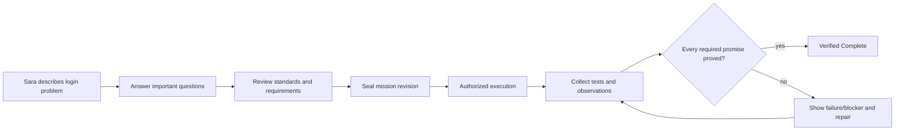
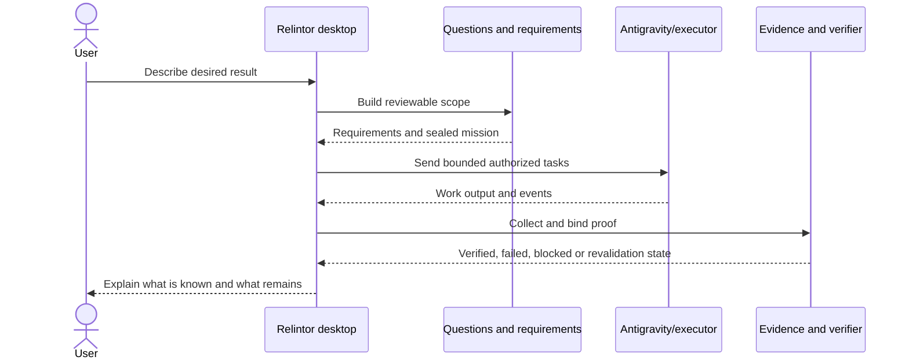
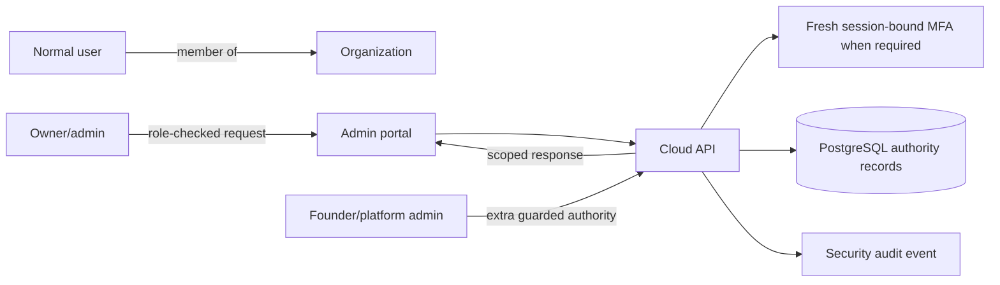

# Relintor Complete User & Admin Manual
## The Story-Based Guide for Everyone

> **Document status:** current-state user, team, organization and support guide for the Windows Beta workspace as inspected on 2026-08-18.
>
> Relintor is still completing Beta validation. This manual says when a step is verified locally, when it depends on a live service, and when a capability is future or outside the current Beta evidence. It never treats a screen, a plan, or an AI agent's sentence as proof by itself.

## Current beta audit addendum — 2026-08-18

The historical context-transfer file requested for this audit was not found, so
historical product claims that cannot be supported by the repository are
`UNVERIFIED`. See [`RELINTOR_REPOSITORY_VERIFICATION.md`](RELINTOR_REPOSITORY_VERIFICATION.md)
for the evidence index and current contradictions.

The active Windows desktop configuration contains a valid but unprovisioned
updater configuration. Users should not expect automatic updates until a real
signed public key and HTTPS endpoint are provisioned. The previous startup panic
was caused by an older build reading a null updater configuration; the repaired
artifact has empty launch-error logs, but a direct launch exit code and clean
machine journey still need to be recorded.

The public website source/static asset currently points at the newer x64
installer, while the generated `dist` download remains stale. Do not publish
the current `dist` directory as the final Beta download until the website is
rebuilt and its served installer hash is checked.

## Table of contents

1. [What is Relintor?](#1-what-is-relintor)
2. [The people Relintor is for](#2-the-people-relintor-is-for)
3. [Installation from zero knowledge](#3-installation-from-zero-knowledge)
4. [Sara's first mission](#4-saras-first-mission)
5. [Screen-by-screen guide](#5-screen-by-screen-guide)
6. [Status words explained like a human](#6-status-words-explained-like-a-human)
7. [How to write a good mission](#7-how-to-write-a-good-mission)
8. [What happens after I press Start?](#8-what-happens-after-i-press-start)
9. [What if Antigravity says it is done?](#9-what-if-antigravity-says-it-is-done)
10. [What does Verified Complete mean?](#10-what-does-verified-complete-mean)
11. [Google login guide](#11-google-login-guide)
12. [Antigravity guide](#12-antigravity-guide)
13. [Project guide](#13-project-guide)
14. [Activity and evidence](#14-activity-and-evidence)
15. [Organization/admin guide](#15-organizationadmin-guide)
16. [Founder/admin guide](#16-founderadmin-guide)
17. [Beta tester guide](#17-beta-tester-guide)
18. [Common problems](#18-common-problems)
19. [Safety and trust guide](#19-safety-and-trust-guide)
20. [Frequently asked questions](#20-frequently-asked-questions)
21. [Glossary](#21-glossary)
22. [One-page cheat sheets](#22-one-page-cheat-sheets)
23. [Final story](#23-final-story)

---

## 1. What is Relintor?

Relintor helps people guide software work and check whether the important parts
were actually proved. You describe what you want. Relintor writes down the
things that must be true, lets an execution tool do authorized work, collects
evidence, and checks each promise before it calls the mission complete.

### The 60-second version

Imagine you ask a construction manager to build a safe house.

- **You** explain what the house must do.
- **Relintor** writes a checklist: strong doors, working lights, safe wiring,
  and whatever else matters for your house.
- **Antigravity** is the construction crew that may do the work.
- The crew cannot simply shout “finished!” and walk away.
- Relintor sends an inspector to check the checklist.
- The inspector records what was tested and what was not.
- Only when the required things are proven can Relintor say **Verified Complete**.

That is Relintor's central idea:

> **Don't trust done. Prove it.**

### The story version

Sara owns a small website. She asks an AI coding agent to fix login. The agent
may change files and run commands, but the agent is not the judge. Relintor
turns Sara's request into smaller promises, watches the work boundary, checks
the evidence, and tells Sara whether the promises were proved.

### What Relintor does differently from asking an AI directly

An AI coding agent is useful as a worker. It can be fast, creative and helpful.
But a worker can misunderstand the job, test the wrong thing, or forget a
requirement. Relintor keeps four ideas separate:

| Simple idea | Relintor meaning |
|---|---|
| “Please build this” | User intent and mission. |
| “These are the things it must do” | Requirements and acceptance criteria. |
| “Here is the work the crew performed” | Execution and activity. |
| “Here is proof that each promise is true” | Evidence and verification. |

Relintor does not promise mathematical perfection. A verified result means the
required checks passed in the tested scope and environment. It does not mean
that an unknown future user, device, integration or edge case can never fail.

---

## 2. The people Relintor is for

The current repository has different surfaces, but not every future persona is
fully integrated into one seamless product experience. The labels below tell
you what is supported today and what still needs a live or product gate.

### 2.1 First-time normal user — supported desktop journey

You want to start a project, ask for help, and understand whether the result is
proved. You use the desktop Home, Projects, Activity and Account areas.

### 2.2 Developer or user working on a project — supported locally

You choose a project folder, answer investigation questions, review authority
facts, inspect evidence, and work through failures. You should still use your
normal backup/version-control practices.

### 2.3 Team member — partially supported through cloud organization concepts

The cloud model contains organizations, members, team policy, seats,
entitlements and audit records. The current admin portal can request/display
organization data. A full polished team invitation and end-user organization
journey is not claimed as a complete live Beta flow here.

### 2.4 Organization owner/admin — server-backed capability

The cloud service has role and tenant checks, billing status, team policy,
member operations, grants, audit and MFA routes. The current admin UI is an API
portal-style surface that requires a cloud base URL and an access token entered
by the operator. It is not described as a passwordless end-user admin login.

### 2.5 Founder/admin — restricted platform capability

The cloud source includes founder/admin flags, complimentary grants, MFA-bound
admin actions and security audit records. These powers are server-enforced and
must not be inferred from a UI label. Live billing/provider and production admin
validation remain external to the local evidence.

### 2.6 Support/operator — supported as a troubleshooting role, not a magic bypass

Support can ask for safe status, version, platform, error words, request IDs
and reproduction steps. Support must never ask a user to paste a bearer token,
provider key, password, database URL or private key.

### 2.7 Beta tester — supported as a validation role

Beta testers exercise installation, login, project selection, execution,
verification, restart, logout and failure messages. A test that works on the
developer machine is not automatically a clean-machine or ARM64 certification.

---

## 3. Installation from zero knowledge

### 3.1 What you should and should not need

| You should need | You should not need for normal use |
|---|---|
| One Relintor Windows installer | Rust or Cargo |
| A supported Windows computer | WSL |
| A Google account for the closed beta | Visual Studio Build Tools |
| A project folder you are allowed to use | Node or pnpm |
| Internet for cloud login and cloud-backed features | PostgreSQL or a VPS |
| Antigravity if your mission requires execution | A DeepSeek/provider API key |
| | Terminal commands or manual Antigravity CLI knowledge |

The build machine uses Rust, Cargo, pnpm, MSVC and temporary folders to create
the application. Those are developer tools. They are not normal end-user
requirements and should never become a hard-coded product path.

### 3.2 x64 versus ARM64 in plain English

The installer must match the processor family of Windows:

- **x64** is the common Intel/AMD 64-bit Windows computer.
- **ARM64** is a Windows computer using an ARM processor.

If you do not know, open Windows **Settings → System → About** and look for
**System type**. Use the installer whose architecture matches. The repository
configuration is architecture-neutral, but the current local validation is x64;
ARM64 needs its own build and release test before it can be advertised as
fully certified.

### 3.3 Expected installation steps

1. Download the installer from the official Beta distribution location.
2. Choose x64 or ARM64 according to **System type**.
3. Double-click the installer.
4. If Windows SmartScreen warns that the Beta installer is unsigned, confirm
   the publisher/source independently before continuing. Do not disable security
   globally. The current repository record says production signing is not yet
   certified.
5. Finish installation and open **Relintor Beta**.
6. Choose **Continue with Google** in the installed desktop app.
7. A system browser opens. Complete Google login there.
8. Allow the browser to return to Relintor. You do not paste a code into the app.
9. Relintor shows whether the cloud session is signed in.
10. If the mission needs execution, follow the in-app Antigravity availability
    message. The current source can detect candidate CLI installations, but the
    production signed bridge/plugin setup remains a Beta/release dependency.
11. Choose or scan the project folder when the Projects flow asks for one.

### 3.4 What a clean machine should not require

You should not be told to set `D:\Relintor`, install WSL, edit a PowerShell
profile, type a Cargo command, paste a DeepSeek key, or manually place a bridge
binary. If a release build requires any of those for normal operation, report it
as a packaging defect.

---

## 4. Sara's first mission

### 4.1 The request

Sara says:

> “Fix login on my small website and make sure it really works.”

Relintor treats that like a construction manager receiving a vague request for
a house. It asks what “login” means before sending the crew into the building.

### 4.2 What becomes requirements

Sara and Relintor may clarify:

1. A user can open the login screen.
2. A valid supported account can sign in.
3. An invalid or cancelled login does not create an authenticated session.
4. The session is bound to the right user and expires safely.
5. Logout removes access.
6. The required tests or runtime checks actually exercise these behaviors.

The exact requirements depend on Sara's project facts and the sealed authority
review. Relintor must not invent a requirement just because a similar project
usually has one.

### 4.3 Success story

1. Sara starts a project from Home.
2. She answers the investigation questions and reviews the project surfaces.
3. Relintor shows the applicable standards and requirements.
4. Sara reviews the authority summary and seals the mission.
5. The execution adapter performs the authorized work.
6. Activity shows task progress and bounded events.
7. Relintor runs the required tests and collects evidence.
8. Each login criterion becomes verified only when the right evidence passes.
9. The final result says `VERIFIED_COMPLETE` and provides a certificate summary.

### 4.4 Failure and repair story

Suppose the agent changes the login code but the logout test fails.

1. Activity may show that execution finished awaiting verification.
2. Verification records a failed check.
3. The mission does not become Verified Complete.
4. Sara sees the failure instead of a green promise.
5. A repair loop changes the logout behavior.
6. Relintor reruns the affected evidence.
7. If source, lockfile or environment changed, old evidence is invalidated.
8. Only fresh passing evidence can move the requirement to `VERIFIED`.

This is like an inspector finding that the front door works but the emergency
exit does not. “The house is mostly built” is useful context, not a safety
certificate.

### 4.5 Mission journey diagram



---

## 5. Screen-by-screen guide

### 5.1 Home

**What you see:** Relintor branding, system status, onboarding guidance, and
entry points for starting a new project or taking over an existing project.

**What it means:** Home is the front desk. It helps you start; it is not the
place where a mission is silently certified.

**What to click:** Choose the action that matches your situation: new idea or
existing project. Follow the first-run explanations if they are visible.

**What happens next:** You move into Projects and the investigation/takeover
flow.

**Common mistakes:** Asking for “make everything good” without saying what
success means; selecting a folder you do not own; assuming the browser preview
has native authority.

### 5.2 Projects

**What you see:** Investigation questions, answers, assumptions, risks,
architecture decisions, takeover findings, authority facts, applicable packs,
requirements and a seal/review boundary.

**What it means:** Projects is where a vague idea becomes a reviewable plan.
For an existing repository, takeover is designed to inspect it read-only and
record what was found.

**What to click:** Answer known questions. Mark “not sure” when you genuinely do
not know; a recorded assumption is safer than a hidden guess. Review applicable
and not-applicable areas, then continue to authority review.

**What happens next:** The Rust authority builds a mission draft and may allow
sealing only when blockers are resolved or policy-supported explicit decisions
exist.

**Common mistakes:** Treating a recommendation as a fact; assuming a filename
proves a feature; trying to seal from the browser preview; scanning a folder
that includes unrelated private material.

### 5.3 Activity

**What you see:** Current execution state, watchdog state, current turn, active
task, runnable tasks, completed-awaiting-verification count, tool calls,
execution steps, safe-boundary state, events, blockers, external changes and
recovery information.

**What it means:** Activity is the project work ledger. It tells you what has
been observed, not what the worker wishes were true.

**What to click:** Use the available start, step, pause, stop, continue or
revalidate action only when you understand the displayed state. Open
verification when execution is awaiting proof.

**What happens next:** Work may resume, stop safely, enter a retry, or require
fresh verification.

**Common mistakes:** Confusing “finished awaiting verification” with complete;
ignoring an external-change warning; repeatedly retrying a deterministic failure.

### 5.4 Account

**What you see:** Application, local database, locked specification, OS keychain
and Antigravity health panels; Google account status; entitlement summary;
server-backed workspace information; privacy and safe support-snapshot guidance.

**What it means:** Account explains the service and local authority boundary.
The renderer receives a summary, not the session tokens themselves.

**What to click:** Continue with Google or Sign out. Read health details before
asking support for help. Never paste a token into a support ticket.

**What happens next:** Login opens the system browser and returns a cloud session
summary. Sign-out clears the Rust-owned desktop session memory.

**Common mistakes:** Expecting account status to prove a mission; confusing
entitlement with verification; trying to use the browser preview as the native
desktop authority process.

### 5.5 Admin portal

**What you see:** Fields for a cloud base URL and access token, account lookup,
entitlement, billing status, organization members, team policy and audit results.

**What it means:** The current admin app is a cloud API portal surface. The
server, not the form, enforces roles, tenant scope and MFA.

**What to click:** Use only an approved operator workflow. Connect to the
correct cloud environment, then load the account/organization data needed for
the task.

**What happens next:** The portal makes authenticated API calls and shows
fulfilled or failed sections independently.

**Common mistakes:** Pasting a token into a screenshot; using a production
token in a development screen; assuming a visible member list means you may
edit every member; ignoring an authorization error.

### 5.6 Public website

The website is a public React surface with the approved full Relintor branding.
It is not the native mission authority, the cloud admin portal, or a certificate
issuer. Marketing text must not be read as proof that every described future
release capability is live.

---

## 6. Status words explained like a human

### Requirement statuses

| Status | Human meaning | Construction analogy |
|---|---|---|
| `UNSTARTED` | The task exists, but work has not begun. | The house checklist has a line nobody has started. |
| `IN_PROGRESS` | Someone is working on it. | The crew is installing the door. |
| `IMPLEMENTED_UNVERIFIED` | The work appears present, but the inspector has not accepted proof. | The mechanic says the brakes were replaced, but nobody has tested the car yet. |
| `VERIFIED` | The required proof passed for the stated scope. | The brakes were replaced and independently tested. |
| `FAILED` | A required check ran and produced a negative result. | The emergency light was tested and did not turn on. |
| `BLOCKED` | The check could not proceed because something external or forbidden is missing. | The inspector cannot test the elevator because the building power is unavailable. |
| `NOT_APPLICABLE` | An authority-backed decision says the line does not belong to this project. | This house has no swimming pool, and that choice is recorded. |
| `DEFERRED_BY_EXPLICIT_DECISION` | Someone with the right authority deliberately postponed it. | The garden is scheduled for a later contract; it is not claimed finished today. |

### Final mission statuses

| Status | Human meaning |
|---|---|
| `VERIFIED_COMPLETE` | Every required applicable promise has accepted proof in the tested scope. |
| `COMPLETE_WITH_ACCEPTED_RISKS` | The remaining risks were explicitly accepted under the rules; they were not hidden. |
| `STOPPED_INCOMPLETE` | Work stopped before all required proof existed. |
| `BLOCKED_EXTERNAL` | A required outside service, device or environment could not be used. |
| `FAILED_VERIFICATION` | A required check failed or the proof was invalid. |
| `REVALIDATION_REQUIRED` | Something that supported earlier proof changed, so the old proof must be refreshed. |

The most important sentence is:

> **Implemented is not the same as verified.**

---

## 7. How to write a good mission

You do not need to know programming language names. You do need to describe
what “good” looks like.

| Vague request | Better request |
|---|---|
| “Make everything good.” | “Fix Google login, keep the session after restart, and verify logout invalidates the session.” |
| “Make the site fast.” | “The home page should load the main content within the agreed budget on the supported test device, and the measurement must be recorded.” |
| “Add payments.” | “A customer can start checkout, a canceled payment is not marked paid, and the server records the provider event exactly once.” |
| “Make it secure.” | “Reject unauthorized access to the admin route, record the denial, and run the specified security checks.” |
| “Clean up this project.” | “Scan the selected repository read-only, list duplicate dependencies and broken build references, and do not modify files.” |

### A useful mission sentence

Try this pattern:

> “I want **[outcome]** for **[people/project]**. It is successful when
> **[observable conditions]**. Please also prove **[tests/runtime/security
> checks]** and tell me what cannot be checked.”

Specificity helps Relintor create a useful requirement graph. If you are unsure,
say so. An explicit uncertainty becomes an assumption or question that can be
reviewed; a hidden guess can become a wrong implementation.

---

## 8. What happens after I press Start?

Relintor behaves like the construction manager in the continuing story:

1. It receives your request.
2. It asks important questions and records facts/provenance.
3. It decides which standards and requirements apply.
4. It creates a sealed mission revision.
5. It gives the executor bounded tasks rather than an unlimited blank check.
6. The executor works in the authorized project scope.
7. The watchdog watches retries, budgets, dependencies, progress and changes.
8. Relintor collects evidence tied to individual promises.
9. The verifier checks the evidence, including failures and missing checks.
10. If something fails, Relintor shows the repair/blocker path.
11. If everything required passes, the completion authority can issue the final
    result and certificate.



The browser preview may show helpful shapes of the experience, but it cannot
seal a mission, read the Rust-owned DB, run the execution ledger, or fabricate a
certificate.

---

## 9. What if Antigravity says it is done?

Imagine a builder calls you from the driveway and says, “The house is finished.”
You would still check the doors, lights, plumbing and emergency exit. You would
not call the house safe merely because the builder sounded confident.

Relintor treats Antigravity's result the same way:

- “Done” can be recorded as an execution event.
- A successful process exit can be useful evidence for one command.
- Neither automatically proves every requirement.
- Required tests, runtime observations, security checks and external receipts
  still need to be collected.
- A failed or skipped required check remains visible.

If Antigravity is missing, unsupported or unsigned, Relintor should explain the
problem and stop or block the relevant execution. The current source has
detection and safety contracts; the signed production plugin/bridge setup is
still a Beta/release dependency.

---

## 10. What does Verified Complete actually mean?

It means:

- the mission revision and applicable requirements were known;
- required acceptance criteria were represented;
- evidence was collected for the stated scope;
- evidence was fresh, intact and bound to the right requirement/criterion;
- required deterministic gates did not fail or get silently skipped;
- required external gates were available or policy explicitly accounted for
  them; and
- the completion authority accepted the resulting report.

It does **not** mean:

- the software can never have a bug;
- every possible input or device was tested;
- a third-party service will never change;
- macOS/Linux/ARM64 passed because Windows passed;
- an unsigned Beta installer is ready for public release;
- the AI agent is always correct;
- all future changes are covered by the old certificate.

If the source, lockfile, environment, project scope or sealed authority changes,
Relintor may require revalidation. That is a safety feature, not a nuisance.

---

## 11. Google login guide

### What happens

When you choose **Continue with Google** in the installed desktop app:

1. Relintor creates a temporary secret-like state value and PKCE verifier inside
   the native process.
2. It opens your normal system browser.
3. Google performs the login there.
4. Google returns a short-lived authorization response to a temporary local
   loopback callback.
5. Relintor checks that the callback path and state are exactly expected.
6. The native process exchanges the code and then asks the Relintor Cloud API
   for a Relintor session.
7. The renderer receives only a summary such as signed-in status and email.

### What it does not ask you to do

- You do not paste an authorization code into the app.
- You do not provide a Google client secret.
- You do not provide a DeepSeek/provider key.
- You do not copy a bearer token into the UI.

### Common login problems

| Problem | Safe next step |
|---|---|
| Browser never opens | Check that the installed app is allowed to launch the default browser; record the exact message for support. |
| You cancel Google login | Return to Relintor and try again when ready. Cancellation is not a signed-in state. |
| Browser does not return | Check local firewall/browser restrictions; do not paste tokens into chat or support. |
| Cloud unavailable | Wait and retry; the app should show unavailable rather than pretending the account is active. |
| Wrong account | Sign out, close the browser account session if needed, and retry with the intended Google account. |

### Logout

Use **Sign out** in Account. The desktop clears its Rust-owned in-memory
session. Cloud-side session revocation and refresh behavior are server concerns;
do not assume closing a window is the same as a deliberate sign-out unless the
current UI says so.

---

## 12. Antigravity guide

Antigravity is the worker in the construction story. Relintor is the manager and
inspector. The worker may edit the authorized project and emit structured
events, but Relintor owns the mission scope, task packet, stop rules, evidence
and final decision.

### Detection

The desktop/core boundary can look for an explicit path override or candidate
CLI names such as `agy`/`agy.exe` in the system path. It records version output
when available. Executable presence alone does not prove supported
compatibility.

### Missing or unsupported Antigravity

Relintor should show a clear unavailable/unknown message. It must not pretend
that a missing worker completed a task, and it must not ask a normal user to
learn an internal CLI command as the ordinary product path.

### What is Beta-dependent

The repository contains a compatibility registry and bridge contract, but the
bridge manifest says the expected digest/signing identity is external and the
production plugin/adapter path is still incomplete in the P12 assessment. A
Beta tester should report the detection result, version, platform and exact
message; do not install random binaries or bypass signature checks.

---

## 13. Project guide

### Choosing a folder

Choose the project folder you intend to inspect or change. Avoid selecting your
entire user profile, a drive root, or a folder containing unrelated private
projects. Confirm that you have permission to work there.

### New versus existing project

- **New project:** start with an idea. Relintor asks questions and creates a
  blueprint before implementation.
- **Existing project:** use takeover. The scanner is designed to inspect source,
  manifests, tests, migrations and documentation read-only, record a
  fingerprint, and report findings. It should not execute an imported project
  in place.

### What may change

Only an authorized, sealed execution should change project files. A read-only
takeover or investigation should not. Keep backups and version control before
allowing an AI executor to work.

### After verification

Review the result, evidence, failures, accepted risks and certificate summary.
Do not delete the project or evidence just because the screen looks green.

---

## 14. Activity and evidence

### How to read progress

- **Current task:** what the scheduler says is active.
- **Runnable tasks:** tasks whose dependencies and policy allow them.
- **Tool calls/steps:** observed execution usage, not a quality score.
- **Watchdog state:** health, warning, repeated command, oscillation, no
  progress, budget, drift, external modification or safe boundary.
- **Safe boundary:** a point where stopping is safer than continuing.
- **Events:** persisted activity with sequence, task and detail.
- **Time limit:** Closed-Beta tasks receive a fixed 10-minute authority window.
  The lease and task budget end together; Relintor stops the owned worker at
  that boundary. The independent Antigravity process safety ceiling remains 15
  minutes and cannot extend the task lease.

Tasks advance manually in the Closed Beta. After one task succeeds, Activity
shows how many remain and offers **Run next task**. This keeps each external
attempt single-flight and prevents a second task from being dispatched while
the first owned process is active.

### How to read verification

Look for:

- requirements verified versus total;
- missing evidence;
- failed checks;
- skipped checks;
- stale evidence;
- blocked external dependencies;
- accepted risks;
- evidence count;
- completion certificate or reason it was not issued.

### Example

If you see:

```text
finished tasks: 4
requirements verified: 2 / 5
failed checks: logout invalidates session
```

the correct understanding is “the crew finished four work tasks, but the house
is not certified.” Ask Relintor to repair the failed requirement or explain the
blocker. Do not report the mission as complete.

---

## 15. Organization/admin guide

### What the current cloud model supports

The cloud source includes:

- users and organizations;
- organization membership roles: owner, admin and member;
- team policy;
- plans and entitlements;
- usage buckets and complimentary grants;
- subscriptions and billing status;
- founder/admin identities;
- MFA challenges and proofs;
- admin actions and security audit events.

### Current admin portal workflow

1. Open the admin portal in its approved operator environment.
2. Connect it to the correct cloud API environment.
3. Use an approved authenticated access method; do not paste the token into a
   screenshot or documentation.
4. Load the account and inspect entitlement, billing, members, policy and audit
   sections.
5. Treat each failed section independently; one successful API call does not
   prove every other section succeeded.
6. Record the reason and request context for any authorized mutation.

The server—not the admin form—checks the current user, organization scope,
role, session and MFA proof. An owner cannot use a UI field to become a founder,
and a member cannot use an edited request body to become an admin.

### Current versus future

The source-backed routes and local tests demonstrate admin boundaries. A polished
production organization onboarding, billing provider integration, and fully
live PostgreSQL admin workflow remain separate validation work. Do not describe
the current portal as a certified production billing console until those gates
run.

### Admin relationship diagram



---

## 16. Founder/admin guide

Founder/platform-admin power is more dangerous than normal project work because
it can affect other users, organizations, grants, billing state or audit data.

### Normal user action

- Start or take over a project.
- Answer investigation questions.
- Review requirements and evidence.
- Sign in/out of their own account.
- Start, pause, stop or revalidate their authorized mission.

### Organization admin action

- Inspect organization members and policy.
- Perform approved member/policy/grant operations under server role checks.
- Review billing/entitlement/audit information.
- Complete the required fresh MFA proof where the route demands it.

### Founder/platform-admin action

- Manage founder/complimentary grant authority through protected server routes.
- Review platform audit events and exceptional account situations.
- Apply policy only with a reason, scoped target and recorded outcome.

### Safety rule

Admin status is not permission to bypass verification, change a sealed mission,
read a user's project content without authorization, or request a secret in a
support channel. Use the least powerful operation that solves the problem and
leave an audit trail.

---

## 17. Beta tester guide

### Beta checklist

- [ ] Download the intended Windows architecture installer.
- [ ] Confirm the publisher/source before accepting an unsigned Beta warning.
- [ ] Install on a clean or disposable test machine when possible.
- [ ] Launch **Relintor Beta**.
- [ ] Confirm the full Relintor wordmark and Beta label look correct.
- [ ] Try Google login in the system browser.
- [ ] Confirm cancellation and failure states are truthful.
- [ ] Confirm Account does not display tokens or ask for provider keys.
- [ ] Check local project selection and invalid-path behavior.
- [ ] Check Antigravity detection and record the exact availability message.
- [ ] Create a small mission with clear acceptance conditions.
- [ ] Observe execution activity and watchdog states.
- [ ] Confirm “finished” is not presented as “verified” prematurely.
- [ ] Trigger or observe a deterministic failure safely.
- [ ] Confirm repair/revalidation messaging.
- [ ] Restart the app and check expected local/account behavior.
- [ ] Sign out explicitly.
- [ ] Exercise uninstall only in a disposable environment after confirming the
      current release gate supports the expected export/preserve behavior.

### Useful bug report

```text
Title: Beta – Google callback did not return to Relintor
Build/version: [visible version]
Windows architecture: x64 or ARM64
What I expected: Browser login returns to the app and shows signed in.
What happened: Browser showed success, app remained signed out.
Exact visible error: [copy only the safe error text]
Steps: 1. ... 2. ... 3. ...
Reproducible: always / sometimes / once
Request ID: [only if the app displayed one; never paste a token]
Attachments: screenshots with tokens, keys and private project content removed
```

### What not to do as a tester

- Do not disable Windows security globally.
- Do not install an unsigned bridge from an unknown source.
- Do not paste tokens or API keys into a bug report.
- Do not test destructive uninstall on the only copy of your evidence/project.
- Do not call an external platform passed because your local Windows run passed.

---

## 18. Common problems

| Problem | Simple explanation | Safe steps |
|---|---|---|
| Relintor will not open | Windows or the installer may have blocked an unsigned Beta artifact. | Check the source, SmartScreen details and Windows Event Viewer; report the version and message. Do not download a replacement binary from a random link. |
| SmartScreen warning | The current release record says signing is not certified. | Confirm the official source and test in a disposable machine. Request a signed release for normal distribution. |
| Google browser does not return | The temporary local callback may be blocked or timed out. | Retry, check browser/firewall behavior, and report exact safe text. Never paste a code/token. |
| Internet is offline | Cloud-backed operations cannot refresh remote state. | Wait/retry; use local work only when the app explicitly allows it. |
| Cloud unavailable | The account/session service cannot be reached or is not ready. | Treat account/entitlement as unavailable, not valid. Contact support with safe diagnostics. |
| Antigravity not detected | The executable is missing, not on a discoverable path, or compatibility is unknown. | Record platform/version and follow the official setup guidance. Do not fake a pass or install an unknown bridge. |
| Project will not open | The path may be invalid, inaccessible or outside the allowed scope. | Choose a specific project folder you own and retry. Check permissions. |
| Mission is blocked | A required decision, dependency, or external service is missing. | Read the blocker, resolve it or make an explicit supported decision. |
| Verification failed | A required test/observation found a problem. | Read the failed check, repair the project, and rerun affected evidence. |
| AI unavailable | The gateway/provider is unavailable or the session is not authorized. | Continue with deterministic checks if offered; do not provide a provider key. |
| Revalidation required | Earlier proof no longer matches current source, lock, environment or authority. | Run fresh verification. Do not reuse an old certificate. |
| Activity says finished awaiting verification | Work ended, but the inspector has not approved the promises. | Open verification; it is not final completion. |

---

## 19. Safety and trust guide

Relintor exists because “the worker says it is done” is not enough. You should
still use normal judgment:

- Keep backups and version control before allowing changes.
- Review important diffs, especially authentication, payments, deletion and
  production configuration.
- Never give support a password, session bearer, provider key, database URL,
  private key or Google secret.
- Remove private project data from screenshots and logs.
- Treat irreversible actions as separate decisions.
- Confirm the correct project folder before starting.
- Treat external service results as scoped observations, not universal truth.
- If Relintor says blocked or unverified, believe that boundary until the cause
  is resolved and proof is refreshed.

### The four-question safety pause

Before approving an important action, ask:

1. **What project and files can this touch?**
2. **What is the exact requirement or user outcome?**
3. **What evidence will prove it?**
4. **What happens if the external service or test is unavailable?**

---

## 20. Frequently asked questions

### Is Relintor an IDE?

It has a desktop UI for project, execution and verification workflows, but its
main identity is an authority and proof layer rather than a replacement text
editor or ordinary chat IDE.

### Does Relintor replace Antigravity?

No. Antigravity is the intended execution worker/adapter. Relintor governs its
scope and checks its results.

### Does Relintor need my provider API key?

Not for normal use. The AI Gateway is designed to keep provider credentials on
the server. Never paste a provider key into the desktop or support message.

### Can Antigravity mark itself done?

It can report a process result, but it cannot independently make the mission
Verified Complete.

### What is evidence?

Evidence is a structured record of an observed check: for example a bound test
output, build result, API response, database observation, browser observation,
security scan or external receipt.

### What is a sealed mission?

A sealed mission is a revisioned, integrity-bound set of facts, requirements,
acceptance criteria, tasks and scope. Later changes require revalidation or a
new revision.

### What happens offline?

Local-first screens may still show local state, but cloud sessions, account
refresh, Google login, provider calls and external evidence may be unavailable.
Relintor should say unavailable rather than creating a false pass.

### Can I use it on ARM Windows?

The configuration is intended to support an ARM64 Windows build, but the
current local evidence is not an ARM64 runtime/package certification. Use an
ARM64 installer only when that release gate has actually run.

### Can I use macOS or Linux today?

The repository does not claim current hosted macOS/Linux certification. Those
gates remain deferred/not run in the current evidence.

### Does Verified Complete mean perfect software?

No. It means the required checks passed for the declared scope and environment.
Unknown inputs, future changes and untested integrations can still matter.

### What happens when verification fails?

The failure remains visible. You repair the relevant requirement, collect fresh
evidence, and verify again. A green unrelated check does not erase the failure.

### Can I stop a mission?

The desktop/execution model has pause, stop, safe-boundary and recovery concepts.
Use the visible control and read the resulting state. Stopped is not the same
as verified complete.

### What happens to project data?

Relintor is local-first. Project paths, local evidence and mission/execution
records are primarily handled on the device. Cloud services handle account,
organization, session, entitlement and related server authority. Only an
authorized bounded workflow should send project context externally.

### Why is it Beta?

Local implementation and tests can pass while real Google/PostgreSQL/provider/
Antigravity, signing, clean-machine, ARM64, cross-platform and usability gates
remain to be executed. Beta is an honest validation stage.

### Will updates be automatic?

The repository contains signed-update safety primitives, but the P12 report
identifies the integrated automatic updater path as a remaining gap. Do not
assume automatic rollback/update is certified.

### Does uninstall preserve my evidence?

Safety/export primitives exist, but the required product uninstall/export choice
is recorded as incomplete. Back up important project/evidence data before a
Beta uninstall test.

### Do I need Rust, WSL, Visual Studio or pnpm?

No for normal installed-app use. Those are build/development tools.

### Is the website the same as the desktop authority?

No. The website is a public frontend surface. Native authority, local DB,
execution and certificates require the installed desktop Rust process.

### Why does the app show “unavailable” instead of guessing?

Because a missing cloud, database, AI, browser, Antigravity or platform result
is not proof. Fail-closed wording is safer than a friendly false green state.

---

## 21. Glossary

| Term | Simple meaning | Real-life analogy |
|---|---|---|
| Acceptance criterion | A specific condition that must be true | One line on the house inspection checklist |
| Adapter | A controlled connection to another tool | A safe doorway for the construction crew |
| Antigravity | Intended AI execution worker/runtime | The construction crew |
| Authority | The component allowed to make a particular trusted decision | The licensed inspector, not a passerby |
| Bearer token | A secret string that grants access to whoever holds it | A key; never photograph or share it |
| Blocked | Cannot proceed because an external/policy dependency is unavailable | Elevator has no power |
| Blueprint | Structured project understanding before work | House plans |
| Certificate | Integrity-bound final verification artifact | Signed inspection certificate |
| Criterion | Another word for acceptance condition | A checklist line |
| Evidence | Recorded proof of an observed check | Inspection photos and test readings |
| Entitlement | Server decision about what an account/org may use | The building permit level |
| Executor | Tool/process that performs work | Construction crew |
| Fingerprint | Digest identifying source/environment state | A seal on the inspected building materials |
| Google OIDC/OAuth | Browser-based identity/login protocol | Asking a trusted identity desk who you are |
| HMAC/hash/signature | Cryptographic integrity tools | Tamper-evident seal |
| Investigator | Component that asks questions and structures intent | The architect interviewing the owner |
| Locked specification | Immutable product requirement source | The signed building code |
| Mission | One scoped piece of work and proof | One construction contract |
| PostgreSQL | Cloud relational database | The organization's central records office |
| PKCE | A protection linking the login request to the returning app | A one-time claim ticket |
| Revalidation | Checking again after an important input changes | Re-inspecting after the wall was rebuilt |
| Requirement | A promise the project must satisfy | “The emergency exit must open” |
| Renderer | Visible React UI | The office display board |
| Rust authority | Native backend that owns privileged operations | The manager's locked control room |
| Session | Authenticated period of cloud access | A visitor badge with an expiry |
| Seal | Integrity-bound mission revision | Signed approved plans |
| Tauri | Native shell hosting the web UI | The building around the office board |
| Tenant | User/organization scope in cloud data | Which company owns the room |
| Verified | Requirement proof passed | Inspector signed the checklist line |
| Watchdog | Execution health monitor | Safety officer watching for dangerous repetition |

---

## 22. One-page cheat sheets

### Normal user cheat sheet

- [ ] Open Relintor Beta.
- [ ] Sign in through the system browser if cloud features are needed.
- [ ] Start a new idea or choose an existing project folder.
- [ ] Answer what you know; mark uncertainty honestly.
- [ ] Review requirements before sealing.
- [ ] Watch Activity, but remember finished work is not verified work.
- [ ] Read failed, blocked, stale and skipped evidence.
- [ ] Accept a final result only when it matches your intended scope.
- [ ] Never share secrets with support.

### Beta tester cheat sheet

- [ ] Use the correct x64/ARM64 build.
- [ ] Test clean installation when possible.
- [ ] Test Google login, cancel, retry and logout.
- [ ] Test project path validation and a small mission.
- [ ] Test Antigravity detection without bypasses.
- [ ] Test a known failure and verify that it does not become green.
- [ ] Test restart and revalidation messaging.
- [ ] Capture exact safe errors, versions and architecture.

### Organization admin cheat sheet

- [ ] Use the approved cloud environment.
- [ ] Confirm your role and organization scope.
- [ ] Complete fresh MFA where required.
- [ ] Inspect members, policy, entitlement, billing and audit independently.
- [ ] Give every mutation a reason.
- [ ] Never paste tokens in screenshots or tickets.
- [ ] Do not override sealed verification authority.

### Founder/operator cheat sheet

- [ ] Treat founder/admin power as exceptional.
- [ ] Confirm target user/org before a grant or policy action.
- [ ] Require MFA and audit outcome.
- [ ] Check seat, usage, entitlement and expiry effects.
- [ ] Never use a UI label as proof of permission.
- [ ] Keep release/signing/provider/database secrets outside the repository and desktop.
- [ ] Preserve every pending external/release gate honestly.

---

## 23. Final story

Sara downloads the correct Windows Beta installer for her x64 computer. Windows
shows an unsigned-Beta warning, so she confirms that the file came from the
approved source and installs it on a test machine. She opens **Relintor Beta**.

The full Relintor wordmark is visible in the app header, with a small Beta label
beside it. Sara chooses **Continue with Google**. Her normal browser opens; she
logs in, and Relintor returns without asking her to paste a code or API key.

Sara chooses her website folder. Relintor asks what login means for her: which
users, which identity provider, what logout should do, and how she wants the
result tested. Sara says: “A user can sign in, a cancelled login stays signed
out, sessions expire, and logout invalidates access.”

Relintor shows the resulting requirements. Sara reviews them and seals the
mission. The execution worker receives bounded tasks. Activity shows the worker
editing the project and running commands. The worker reports success.

Relintor does not stop there. Like the house inspector, it collects the required
test and runtime evidence. The first logout test fails. The screen says
`FAILED`, not Verified Complete. Sara reads the failure, lets the worker repair
the logout path, and starts fresh verification. The source fingerprint changed,
so old proof is not reused.

The second check passes. The browser/runtime observation and deterministic tests
are bound to the right requirements. The report shows every required line
verified, no skipped required check, and a certificate summary. Sara now has a
truthful result for the tested scope: **Verified Complete**.

Later, Sara changes the session library. Relintor notices that the source state
no longer matches the old evidence and shows **Revalidation Required**. Sara is
not punished for changing the project; she is simply asked to inspect the new
building again. That is the point of Relintor: confidence should follow proof,
not survive changes by habit.
