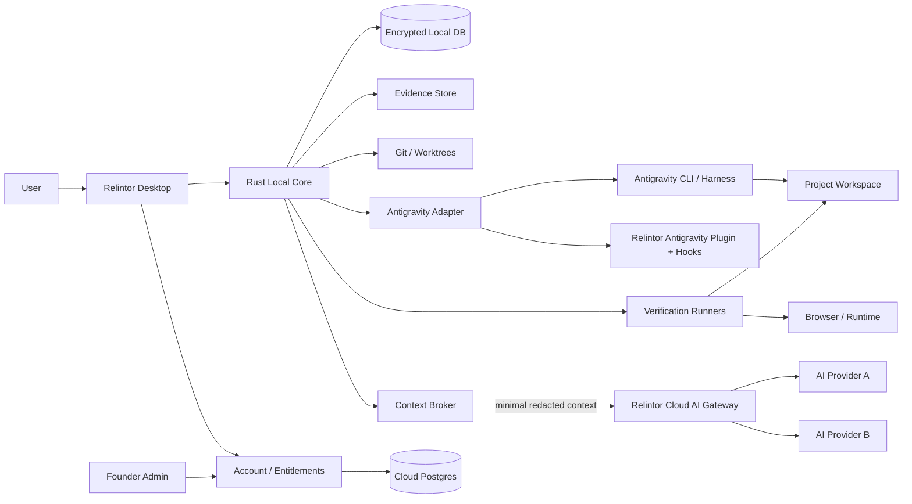

# 02 — System Architecture

## 1. Technology decisions

### Desktop
- **Tauri 2**
- **React + TypeScript**
- founder theme tokens
- Rust commands/events for privileged local operations

### Local core
- **Rust**
- SQLite for project/evidence graph
- encrypted local secrets/credentials via OS keychain
- content-addressed evidence store
- Git integration
- process supervision
- local HTTP/browser test coordinator where required

### Cloud
- TypeScript service layer (Fastify or equivalent lean framework)
- PostgreSQL
- Redis only where rate limiting/short-lived coordination requires it
- object storage only for user-authorized exports/team evidence
- AI gateway with provider adapters
- subscription/entitlement service
- signed standards-update service
- admin API

### Admin web
- React/Next.js
- separate admin authentication and MFA
- RBAC

## 2. Architecture



## 3. Local-first meaning

Local-first does **not** mean “no network.”

It means:
- canonical project graph lives locally;
- full repository is not uploaded to Relintor;
- evidence remains local unless the user/team enables sync/export;
- cloud account service stores identity, plan and entitlements;
- cloud AI requests receive a locally prepared minimum context package;
- secret scanning/redaction runs before transmission;
- provider responses are attached to evidence with provenance;
- users can see when cloud intelligence was used.

## 4. Context Broker

The Context Broker is mandatory because Relintor pays for AI while protecting customer code.

Pipeline:

```text
verification/investigation question
→ local retrieval
→ local secret scanner
→ minimum necessary files/snippets/metadata
→ context budget
→ redaction
→ policy check
→ TLS
→ Relintor AI gateway
→ provider
→ structured response
→ provenance + hash
→ local evidence
```

The gateway never exposes provider keys to clients.

## 5. Trust boundaries

### Trusted authority
- local Rust core
- signed product policy
- sealed mission contract
- deterministic test outputs

### Semi-trusted
- Antigravity
- cloud AI providers
- browser automation
- project documentation

### Untrusted claims
- builder “done” messages
- stale README claims
- unchecked screenshots
- manually edited evidence
- inferred test success

## 6. Local database domains

- accounts cache
- projects
- source snapshots
- missions
- requirements
- decisions
- standards
- tasks
- task dependencies
- executions
- tool calls
- checkpoints
- evidence
- verifications
- risks
- exceptions
- usage
- receipts
- completion certificates

## 7. Security
- OS keychain for refresh/device secrets
- encrypted local sensitive database fields
- signed entitlement tokens
- signed remote standards packs
- TLS pinning considered, with safe rotation design
- automatic secret redaction before logs/AI
- no provider API secrets in desktop bundle
- auto-update package signatures
- admin MFA mandatory
- audit trail for all complimentary-license/admin changes

## 8. Cross-platform support

Product support baseline follows Antigravity:
- Windows 10 64-bit+
- macOS supported versions, current Antigravity minimum
- Linux meeting current Antigravity glibc/glibcxx requirements

Packaging and release certification are separate for every OS. A passing Windows build does not certify macOS/Linux.
