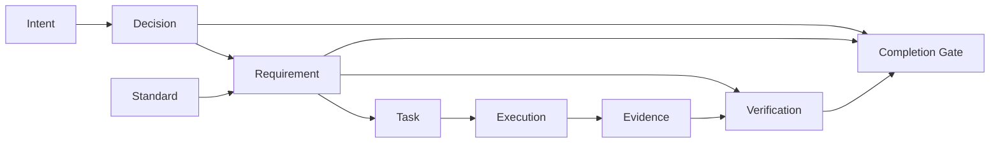

# 05 — Requirement & Evidence Graph

## 1. Core data model

## 2. Requirement object

Fields:
- stable ID
- title
- plain-language intent
- source (user/doc/standard/inference)
- priority
- applicability
- acceptance criteria
- verification plan
- dependencies
- risk
- current status
- implementation links
- evidence links
- explicit exceptions
- sealed hash

## 3. Evidence classes

- source diff
- file hash
- build output
- test output
- lint/static analysis
- API response
- database query
- browser recording
- screenshot
- accessibility result
- performance result
- security scan
- deployment probe
- external-service receipt
- human decision
- AI verifier judgement
- environment fingerprint

## 4. Evidence confidence

`STRONG_DETERMINISTIC`
`STRONG_RUNTIME`
`CORROBORATED`
`AI_REVIEWED`
`HUMAN_ASSERTED`
`WEAK`
`MISSING`

Requirement verification policy declares minimum confidence.

## 5. Pencil-whipping prevention

A checkbox has no authority by itself.

A task can be `complete` while its requirement remains `IMPLEMENTED_UNVERIFIED`.

The completion engine rejects:
- missing evidence;
- evidence from wrong commit;
- stale evidence after relevant file changes;
- failed tests hidden by later output;
- skipped tests without explicit decision;
- screenshots without environment linkage;
- AI statements that are unsupported by machine evidence.

## 6. Evidence invalidation

When code changes:
1. map changed files to impacted requirements;
2. invalidate only affected evidence;
3. mark those requirements `IMPLEMENTED_UNVERIFIED`;
4. schedule re-verification.

## 7. Final certificate

Certificate includes:
- mission ID;
- sealed contract hash;
- source commit/tree;
- environment;
- requirement totals by status;
- verification suites;
- accepted risks;
- blocked/deferred items;
- evidence manifest hash;
- product version;
- timestamp.

`VERIFIED_COMPLETE` is impossible if FAILED, BLOCKED, UNKNOWN, or silently deferred requirements remain.
