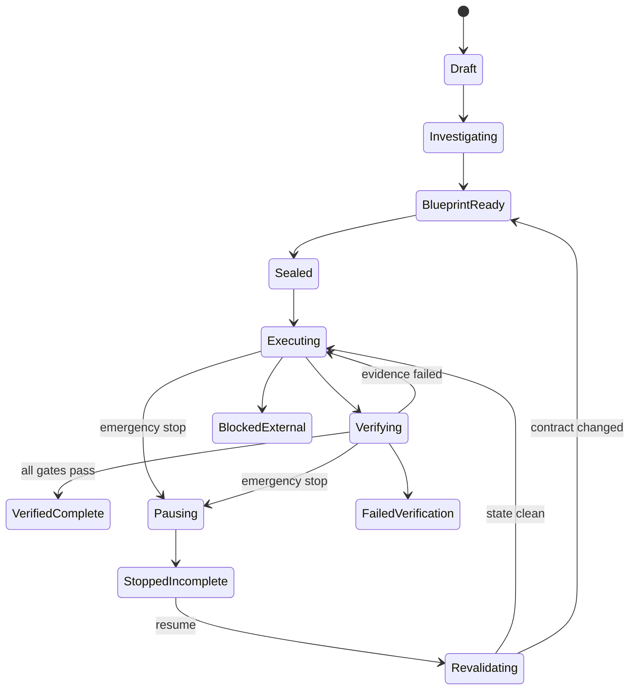

# 06 — Execution, Watchdog & Recovery

## 1. Mission state machine

## 2. Scheduler

Responsibilities:
- dependency-aware task ordering;
- parallelism only for non-conflicting tasks;
- clean-context turn boundaries;
- per-task execution budgets;
- retry policy;
- failure strategy;
- verification scheduling;
- checkpoint cadence.

## 3. Execution lease

Every mutable task receives:
- workspace scope;
- file/resource scope;
- tool permissions;
- external authority;
- time/step budget;
- evidence obligation;
- expiry.

## 4. User interruption

Emergency stop:
1. deny new mutable actions;
2. request current runner stop;
3. wait only for defined safe boundary;
4. terminate if boundary timeout is reached;
5. capture workspace diff;
6. capture process state;
7. checkpoint;
8. reconcile requirement statuses;
9. mark `STOPPED_INCOMPLETE`.

Never delete user work as punishment.

## 5. Crash recovery

On restart:
- detect unclosed execution lease;
- verify repo/worktree state;
- compare hashes;
- detect active orphan processes;
- reconcile logs;
- invalidate uncertain evidence;
- require revalidation if external changes occurred.

## 6. External modifications

While a mission is sealed:
- file watcher records external edits;
- impacted evidence becomes stale;
- if changes conflict with active task scope, execution pauses;
- user sees `REVALIDATION_REQUIRED`.

## 7. Checkpoints

Checkpoint types:
- Git commit/worktree snapshot where safe;
- file content-addressed snapshot for untracked work;
- database snapshot/migration marker for local test DBs;
- config snapshot;
- evidence manifest.

No generic “rollback supported” claim. Each mutation type has an explicit restore/compensation strategy.

## 8. No-progress governor

A “progress unit” means one of:
- requirement advanced;
- evidence created;
- failing test changed meaningfully;
- blocker diagnosed with new information.

The governor tracks progress per execution budget and restarts with a diagnostic context when progress stalls.

## 9. Usage control

Track:
- Antigravity turns;
- tool calls;
- elapsed time;
- visible credit/quota telemetry when officially exposed;
- Relintor cloud AI tokens/cost;
- verifier calls;
- retries;
- no-progress spend.

Never fabricate remaining Antigravity quota if the platform does not expose it.
