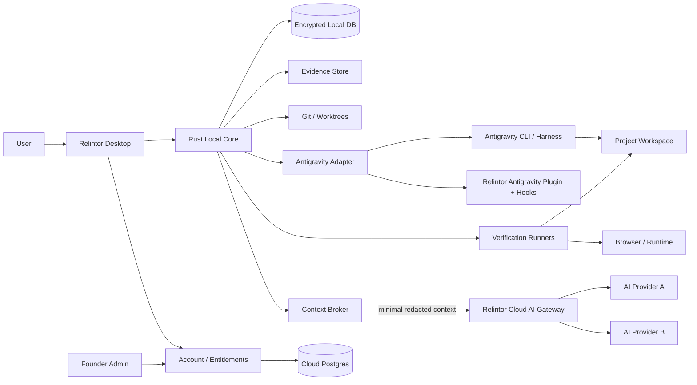
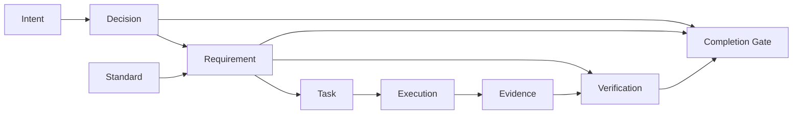
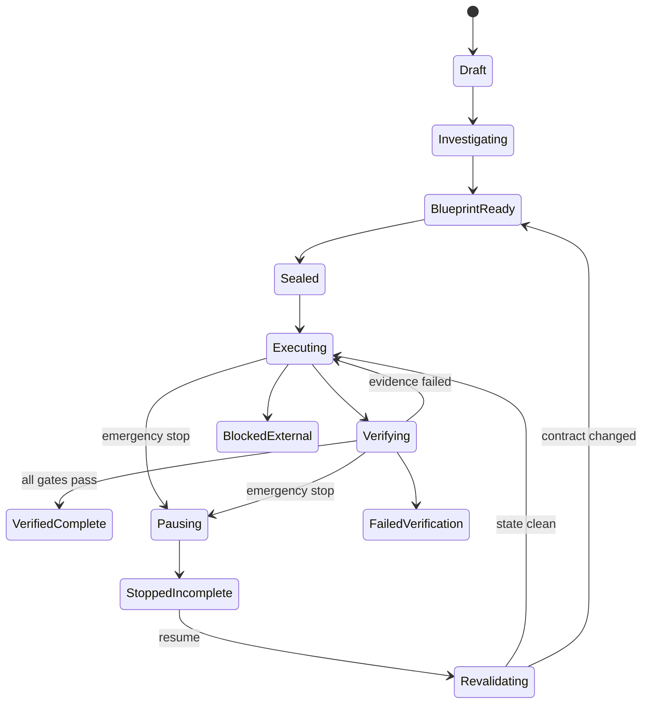

# Relintor — Master Sealed Product Specification

**Date:** 2026-08-13

# 00 — Product Constitution

## 1. Mission

Relintor exists because AI coding systems can produce believable activity without producing a complete, professional, verified result.

The product owns three failures:

1. **False completion** — an agent claims completion without sufficient evidence.
2. **Latent engineering ignorance** — users do not know which professional decisions, standards, tests, and future-facing foundations they should ask for.
3. **Execution abandonment or corruption** — long software missions are interrupted, loop, drift, waste usage, or stop with partially changed state.

## 2. Immutable promise

> Give Relintor an idea, specification, or existing project. Relintor determines what professional completion requires, seals the mission, governs the Antigravity execution loop, continuously accounts for requirements and evidence, and does not issue a verified completion result until the evidence supports it.

## 3. The authority hierarchy

From strongest to weakest:

1. deterministic safety and verification results;
2. sealed project contract;
3. explicit founder/user decisions captured before sealing;
4. curated professional standards registry;
5. independent verifier judgement;
6. builder-agent claims.

A lower layer may never override a deterministic failure.

## 4. Completion states

Only these final states exist:

- `VERIFIED_COMPLETE`
- `COMPLETE_WITH_ACCEPTED_RISKS`
- `STOPPED_INCOMPLETE`
- `BLOCKED_EXTERNAL`
- `FAILED_VERIFICATION`
- `REVALIDATION_REQUIRED`

There is no generic green “Done” state.

## 5. Requirement accounting invariant

Every sealed requirement must always be exactly one of:

- `UNSTARTED`
- `IN_PROGRESS`
- `IMPLEMENTED_UNVERIFIED`
- `VERIFIED`
- `FAILED`
- `BLOCKED`
- `NOT_APPLICABLE`
- `DEFERRED_BY_EXPLICIT_DECISION`

A requirement may never disappear from the graph because the agent forgot it.

## 6. Founder decisions frozen

- Closed-source commercial software.
- Monthly and annual subscriptions.
- Individual and team customers.
- Founder/admin can create complimentary access, trials, custom entitlements and company grants.
- User never configures API keys for Relintor.
- Relintor pays for its own AI intelligence usage.
- Local-first project state.
- Source code is not bulk-uploaded to Relintor servers by default.
- Cloud AI receives only the minimum scoped context needed for a requested judgement, after local secret scanning/redaction; retention policy must be zero/limited according to provider contract.
- Windows, macOS and Linux ship together for the Antigravity release.
- Strict sealed execution is the default.
- Emergency stop always remains available.
- Normal users use GUI only; terminal/PowerShell/manual JSON is not required.
- Antigravity is the first execution adapter, not a hard-coded permanent dependency.
- Product quality beats preserving any existing stack.

## 7. What “99%” means

Do not market “99% bug-free software.”

Internal quality target:

> **False verified-completion rate < 1% on the maintained acceptance corpus.**

Additionally:

> **100% of sealed requirements must be accounted for.**

## 8. Product boundaries

### Included in the first full release
- New Project mode
- Existing Project Takeover mode
- Professional standards intelligence
- project questioning/investigation
- sealed architecture and requirement contract
- task decomposition
- Antigravity execution governance
- permission automation
- execution watchdog
- anti-loop detection
- requirement traceability
- deterministic and AI-assisted verification
- browser/runtime verification
- recovery and resume
- evidence explorer
- completion certificate
- user/team subscriptions
- founder admin
- cross-platform installers and updates

### Explicitly excluded from this release
- Claude/Codex/Cursor execution adapters
- claiming universal OS interception outside routed missions
- irreversible external-side-effect rollback where no compensation exists
- legal/compliance certification guarantees
- “all code is correct” guarantees
- Windows 7 support

## 9. Product ethics and truth rule

Relintor must hold itself to the same standard it imposes on agents:
- no capability is listed as complete without test evidence;
- skipped acceptance tests are visible;
- unsupported platforms are not marketed;
- inferred evidence is labeled inferred;
- user-accepted risk is not silently converted to verified success.


---

# 01 — UX/UI Specification

## 1. UX thesis

The engine is complicated. The interface must feel like a toy.

A new user should understand the product from four verbs:

**Describe → Seal → Watch → Verify**

The main navigation has only:

1. **Home**
2. **Projects**
3. **Activity**
4. **Account**

Team administration appears inside Account for authorized users. Technical internals remain hidden behind an optional “Details” drawer.

## 2. Visual system

Use the founder-supplied warm parchment/brown palette as the canonical design tokens.

### Typography
- Display / editorial: `Lora`
- UI / body: `Libre Baskerville`
- Machine evidence / ASCII / IDs: `IBM Plex Mono`

### Character
- paper-like background;
- thin brown rules;
- slightly squared 4px radius;
- subtle offset shadows;
- no glassmorphism;
- no neon gradients;
- no “AI purple”;
- no giant dashboard of meaningless metrics;
- status conveyed by words + icons, never color alone.

## 3. Core shell

Desktop shell:

```text
┌─────────────────────────────────────────────────────────────────────┐
│ RELINTOR                                      ● Guardian active     │
├────────────┬────────────────────────────────────────────────────────┤
│ Home       │                                                        │
│ Projects   │                   CURRENT VIEW                         │
│ Activity   │                                                        │
│ Account    │                                                        │
│            │                                                        │
│            │                                                        │
│ v2.x       │                                                        │
└────────────┴────────────────────────────────────────────────────────┘
```

## 4. Home

Only three important actions:

```text
What are you building?

[ + New project ]   [ Take over existing project ]

Recent missions
────────────────────────────────────
Acme Portal        Building     63%
Ledger App         Verified     ✓
Old SaaS           Needs review !
```

No technical setup controls on Home.

## 5. New Project flow

### Step A — Describe
One large text box and drag/drop documents.

Prompt:
> Tell me what you want to exist when this is finished.

Optional:
- attach docs;
- choose folder;
- choose Git repository.

### Step B — Investigator
Conversation-like, but structured. Every question shows **why it matters**.

Example:

```text
Will public pages depend on Google search traffic?

Why I'm asking:
This changes rendering, metadata and crawlability requirements.

( ) Yes
( ) No
( ) Not sure
```

The user can choose “Not sure”; Relintor must propose a recommendation and tradeoff.

### Step C — Blueprint
The user sees plain-language cards:
- Product
- Users
- Architecture
- Data
- Security
- SEO/accessibility/performance
- Deployment
- Testing
- Future assumptions
- Risks
- Explicitly deferred decisions

Each card has `Why`, `Decision`, `Evidence required`.

### Step D — Seal
One final page:

```text
Mission scope      38 requirements
Quality gates      91 checks
External actions    4 need explicit authority
Estimated phases   11

[ Seal & Build ]

After sealing, scope changes require revalidation.
Emergency stop remains available.
```

## 6. Existing Project Takeover flow

1. Select project folder.
2. Relintor inventories repository.
3. Show “What I found” before asking questions.
4. Reconstruct product capabilities.
5. Compare docs/promises to runtime/code.
6. Ask only unresolved founder questions.
7. Generate keep/repair/remove/rebuild decisions.
8. Seal takeover mission.

Takeover summary uses these labels only:

`WORKING` · `PARTIAL` · `BROKEN` · `MISSING` · `UNPROVEN` · `DEAD/UNUSED`

## 7. Mission Cockpit — the primary product screen

```text
┌────────────────────────────────────────────────────────────────────┐
│ Acme Portal                                      [Emergency stop]  │
│ Building · Phase 6/11 · Guardian active                           │
├──────────────────────────────┬─────────────────────────────────────┤
│ CURRENT                      │ PROOF                               │
│ Authentication hardening    │ 17/22 checks verified              │
│                              │                                     │
│ Antigravity                  │ ✓ build                             │
│ Editing 3 files              │ ✓ unit tests                        │
│                              │ ✓ runtime login                      │
│  █████████████░░  72%        │ … expiry test running               │
│                              │                                     │
│ Next                         │ Open evidence →                     │
│ Verify reset-token expiry    │                                     │
├──────────────────────────────┴─────────────────────────────────────┤
│ Requirements  26/38 verified   Blocked 1   Failed 0   Unknown 2   │
└────────────────────────────────────────────────────────────────────┘
```

The cockpit is not a chat transcript. It is a mission state view.

## 8. Evidence view

The user clicks a requirement and sees:

```text
R-014  Password reset
Status: VERIFIED

Implementation
✓ API route found
✓ UI route found
✓ token persistence found

Tests
✓ valid token
✓ invalid token
✓ expired token
✓ reuse rejected

Runtime
✓ browser flow
✓ database change
✓ mail adapter result

Evidence bundle
E-1042 … E-1051
```

## 9. Failure UX

Never show:
> Something went wrong.

Show:
- what failed;
- what Relintor tried;
- whether repository state changed;
- current safe checkpoint;
- what can happen next.

Buttons:
`Retry safely` · `Change decision` · `Open details` · `Stop mission`

## 10. Emergency stop UX

Single button, always visible during execution.

Sequence:
`Stopping safely → checkpointing → reconciling files → recording incomplete requirements`

Final state:
`STOPPED_INCOMPLETE`

Resume button appears only after integrity/revalidation checks.

## 11. Completion UX

A verified mission ends with a calm certificate, not confetti:

```text
VERIFIED COMPLETE

38 / 38 requirements accounted for
38 verified
0 failed
0 blocked
0 unknown
0 silently deferred

Build: PASS
Runtime: PASS
Security baseline: PASS
Release checks: PASS

[ View certificate ] [ Export evidence ]
```

## 12. Account

- profile
- plan
- AI usage included by plan
- devices
- billing
- privacy
- team/company
- sign out

No API-key screen exists.

## 13. Accessibility
- WCAG 2.2 AA target
- full keyboard navigation
- visible focus
- screen-reader labels
- reduced motion
- 200% zoom support
- status not encoded only by color
- high contrast tested for light/dark themes

## 14. UX acceptance

A first-time user must be able to:
1. create/take over a project;
2. answer investigation;
3. seal;
4. watch progress;
5. understand a failure;
6. stop safely;
7. resume;
8. inspect why a feature is considered verified;

without opening a terminal or reading product documentation.


---

# 02 — System Architecture

## 1. Technology decisions

### Desktop
- **Tauri 2**
- **React + TypeScript**
- founder theme tokens
- Rust commands/events for privileged local operations

### Local core
- **Rust**
- SQLite for project/evidence graph
- encrypted local secrets/credentials via OS keychain
- content-addressed evidence store
- Git integration
- process supervision
- local HTTP/browser test coordinator where required

### Cloud
- TypeScript service layer (Fastify or equivalent lean framework)
- PostgreSQL
- Redis only where rate limiting/short-lived coordination requires it
- object storage only for user-authorized exports/team evidence
- AI gateway with provider adapters
- subscription/entitlement service
- signed standards-update service
- admin API

### Admin web
- React/Next.js
- separate admin authentication and MFA
- RBAC

## 2. Architecture



## 3. Local-first meaning

Local-first does **not** mean “no network.”

It means:
- canonical project graph lives locally;
- full repository is not uploaded to Relintor;
- evidence remains local unless the user/team enables sync/export;
- cloud account service stores identity, plan and entitlements;
- cloud AI requests receive a locally prepared minimum context package;
- secret scanning/redaction runs before transmission;
- provider responses are attached to evidence with provenance;
- users can see when cloud intelligence was used.

## 4. Context Broker

The Context Broker is mandatory because Relintor pays for AI while protecting customer code.

Pipeline:

```text
verification/investigation question
→ local retrieval
→ local secret scanner
→ minimum necessary files/snippets/metadata
→ context budget
→ redaction
→ policy check
→ TLS
→ Relintor AI gateway
→ provider
→ structured response
→ provenance + hash
→ local evidence
```

The gateway never exposes provider keys to clients.

## 5. Trust boundaries

### Trusted authority
- local Rust core
- signed product policy
- sealed mission contract
- deterministic test outputs

### Semi-trusted
- Antigravity
- cloud AI providers
- browser automation
- project documentation

### Untrusted claims
- builder “done” messages
- stale README claims
- unchecked screenshots
- manually edited evidence
- inferred test success

## 6. Local database domains

- accounts cache
- projects
- source snapshots
- missions
- requirements
- decisions
- standards
- tasks
- task dependencies
- executions
- tool calls
- checkpoints
- evidence
- verifications
- risks
- exceptions
- usage
- receipts
- completion certificates

## 7. Security
- OS keychain for refresh/device secrets
- encrypted local sensitive database fields
- signed entitlement tokens
- signed remote standards packs
- TLS pinning considered, with safe rotation design
- automatic secret redaction before logs/AI
- no provider API secrets in desktop bundle
- auto-update package signatures
- admin MFA mandatory
- audit trail for all complimentary-license/admin changes

## 8. Cross-platform support

Product support baseline follows Antigravity:
- Windows 10 64-bit+
- macOS supported versions, current Antigravity minimum
- Linux meeting current Antigravity glibc/glibcxx requirements

Packaging and release certification are separate for every OS. A passing Windows build does not certify macOS/Linux.


---

# 03 — Antigravity Integration Contract

## 1. Integration principle

Antigravity is an execution engine. Relintor is mission authority.

Never automate the Antigravity GUI by mouse/keystroke as the primary integration.

Use:
- CLI/headless execution;
- plugin packaging;
- lifecycle hooks;
- permissions;
- SDK only where its support matrix is suitable;
- structured logs/transcripts;
- project/worktree boundaries.

## 2. Components

### A. Relintor Antigravity Adapter
Rust interface:

```text
detect()
install_bridge()
validate_version()
create_execution()
send_task()
stream_events()
request_stop()
collect_artifacts()
reconcile_exit()
```

### B. Relintor Plugin
Contains:
- rules;
- skills;
- hooks;
- optional MCP bridge;
- constrained subagent definitions where useful.

### C. Headless Runner
Each task execution is a supervised child process.

Captures:
- process ID;
- start/end;
- exit status;
- stdout/stderr;
- transcript/artifact references;
- token/credit telemetry when exposed;
- working directory;
- environment fingerprint.

## 3. Why the Stop hook is not completion authority

Antigravity intentionally limits repeated stop-hook continuations so a bad hook cannot deadlock a conversation.

Therefore:

```text
Agent wants to finish
→ Stop hook reports state to Relintor
→ if turn may continue, request continuation
→ if platform ends turn anyway:
    Relintor independently evaluates mission graph
    if incomplete, start the next controlled execution turn
```

Mission continuity lives outside the Antigravity process.

## 4. Tool interception

Pre-tool policy:

```text
expected + in scope + safe        → ALLOW
expected + protected authority    → ALLOW WITH LEASE
ambiguous                         → DENY + corrective instruction
outside sealed scope              → DENY
destructive but approved contract → ALLOW exact payload only
new dangerous authority           → HUMAN EXCEPTION REQUIRED
```

The user does not click ordinary allow prompts. Relintor makes them from the sealed contract.

## 5. Exact action binding

An execution grant binds:
- mission ID;
- task ID;
- canonical tool name;
- canonical arguments;
- workspace;
- environment;
- expiry;
- policy version;
- authority scope.

Changed payload = new evaluation.

## 6. Task packet sent to Antigravity

Every execution turn receives:
- task objective;
- exact allowed files/scope where known;
- relevant requirements;
- architecture decisions;
- professional constraints;
- required verification evidence;
- previous failure evidence;
- forbidden changes;
- stop condition.

No giant “build the whole app” prompt.

## 7. Builder/verifier separation

Builder:
- may edit within lease;
- may run allowed tools;
- may propose completion;
- cannot set requirement VERIFIED.

Verifier:
- separate Relintor verification job;
- read-only by default;
- cannot silently repair while judging;
- deterministic gates run first;
- AI review can downgrade confidence but cannot override deterministic failure.

## 8. Anti-loop rules

Watch for:
- same failing command repeated;
- edit/revert oscillation;
- repeated identical tool payload;
- no requirement progress across N actions;
- growing token/credit consumption without evidence gain;
- repeated dependency install attempts;
- repeated test execution without code/evidence change.

Actions:
1. warn execution planner internally;
2. inject diagnostic task;
3. switch strategy/model where allowed;
4. checkpoint;
5. terminate turn;
6. resume with clean context;
7. mark BLOCKED if bounded retries fail.

## 9. Compatibility gate

Every supported Antigravity version gets:
- install detection;
- plugin load test;
- hook load test;
- tool deny test;
- tool allow test;
- headless execution test;
- stop/restart continuity test;
- transcript collection test;
- sandbox/permission test;
- browser verification test where applicable.

A version failing the compatibility gate is shown as “Update required” or “Temporarily unsupported,” never silently used.


---

# 04 — Investigation & Standards Engine

## 1. Purpose

Users cannot ask for engineering decisions they do not know exist. Relintor must expose latent requirements without turning every project into an enterprise architecture exercise.

## 2. New Project Investigator

Inputs:
- free-form idea;
- documents;
- sketches/screenshots;
- repo/template if supplied;
- desired deployment;
- user answers.

Outputs:
- product ontology;
- personas;
- critical user journeys;
- non-functional requirements;
- architecture decisions;
- risk register;
- applicable standards packs;
- requirement graph;
- evidence plan.

## 3. Question policy

Ask only questions whose answer changes:
- architecture;
- scope;
- data model;
- security;
- compliance exposure;
- SEO/accessibility;
- deployment;
- cost;
- verification.

Every question includes:
- why it matters;
- recommended default;
- consequence of each choice.

“No idea” is a valid answer.

## 4. Existing Project Takeover

Reality reconstruction sequence:

```text
repository inventory
→ build-system detection
→ dependency graph
→ route/API discovery
→ database/schema discovery
→ auth/permission discovery
→ UI journey discovery
→ tests/CI discovery
→ deployment discovery
→ docs/promises extraction
→ runtime probes
→ capability reconciliation
```

Then classify each discovered capability:
`WORKING / PARTIAL / BROKEN / MISSING / UNPROVEN / DEAD`

## 5. Standards Registry

Standards are data, not hard-coded prompts.

Each standard rule stores:
- domain pack;
- rule ID;
- title;
- source;
- version/date;
- applicability predicate;
- severity;
- rationale;
- expected implementation patterns;
- deterministic checks where possible;
- evidence requirements;
- exceptions.

## 6. Initial domain packs

Full Antigravity release includes curated packs for:

1. Web frontend
2. Backend/API
3. Databases
4. Authentication/authorization
5. Application security
6. Accessibility
7. SEO/discoverability
8. Performance
9. DevOps/release engineering
10. Observability/operations
11. Data/privacy
12. Payments/financial workflows
13. AI/ML applications
14. Blockchain/Web3
15. Mobile
16. Desktop
17. Data engineering
18. Third-party integrations

The engine applies only relevant rules.

## 7. Applicability example

Rule: public-site crawlability

```text
IF public_marketing_pages = true
AND organic_search_relevant = true
THEN require:
  crawlability decision
  metadata
  canonical URL policy
  sitemap/robots behavior
  structured-data applicability review
  performance baseline
ELSE mark N/A with reason
```

No “every app must use SSR” rule exists.

## 8. Standards updates

- signed by Relintor;
- versioned;
- diff shown internally;
- cannot retroactively change a sealed mission without revalidation;
- project may choose “evaluate against newer standards”;
- source/rationale must remain inspectable.

## 9. Architecture Decision Records

Every significant choice becomes an ADR with:
- context;
- options;
- selected decision;
- reason;
- tradeoffs;
- future trigger for reconsideration.

This is how the “foundation above current ground level” idea is implemented without speculative overengineering.


---

# 05 — Requirement & Evidence Graph

## 1. Core data model



## 2. Requirement object

Fields:
- stable ID
- title
- plain-language intent
- source (user/doc/standard/inference)
- priority
- applicability
- acceptance criteria
- verification plan
- dependencies
- risk
- current status
- implementation links
- evidence links
- explicit exceptions
- sealed hash

## 3. Evidence classes

- source diff
- file hash
- build output
- test output
- lint/static analysis
- API response
- database query
- browser recording
- screenshot
- accessibility result
- performance result
- security scan
- deployment probe
- external-service receipt
- human decision
- AI verifier judgement
- environment fingerprint

## 4. Evidence confidence

`STRONG_DETERMINISTIC`
`STRONG_RUNTIME`
`CORROBORATED`
`AI_REVIEWED`
`HUMAN_ASSERTED`
`WEAK`
`MISSING`

Requirement verification policy declares minimum confidence.

## 5. Pencil-whipping prevention

A checkbox has no authority by itself.

A task can be `complete` while its requirement remains `IMPLEMENTED_UNVERIFIED`.

The completion engine rejects:
- missing evidence;
- evidence from wrong commit;
- stale evidence after relevant file changes;
- failed tests hidden by later output;
- skipped tests without explicit decision;
- screenshots without environment linkage;
- AI statements that are unsupported by machine evidence.

## 6. Evidence invalidation

When code changes:
1. map changed files to impacted requirements;
2. invalidate only affected evidence;
3. mark those requirements `IMPLEMENTED_UNVERIFIED`;
4. schedule re-verification.

## 7. Final certificate

Certificate includes:
- mission ID;
- sealed contract hash;
- source commit/tree;
- environment;
- requirement totals by status;
- verification suites;
- accepted risks;
- blocked/deferred items;
- evidence manifest hash;
- product version;
- timestamp.

`VERIFIED_COMPLETE` is impossible if FAILED, BLOCKED, UNKNOWN, or silently deferred requirements remain.


---

# 06 — Execution, Watchdog & Recovery

## 1. Mission state machine



## 2. Scheduler

Responsibilities:
- dependency-aware task ordering;
- parallelism only for non-conflicting tasks;
- clean-context turn boundaries;
- per-task execution budgets;
- retry policy;
- failure strategy;
- verification scheduling;
- checkpoint cadence.

## 3. Execution lease

Every mutable task receives:
- workspace scope;
- file/resource scope;
- tool permissions;
- external authority;
- time/step budget;
- evidence obligation;
- expiry.

## 4. User interruption

Emergency stop:
1. deny new mutable actions;
2. request current runner stop;
3. wait only for defined safe boundary;
4. terminate if boundary timeout is reached;
5. capture workspace diff;
6. capture process state;
7. checkpoint;
8. reconcile requirement statuses;
9. mark `STOPPED_INCOMPLETE`.

Never delete user work as punishment.

## 5. Crash recovery

On restart:
- detect unclosed execution lease;
- verify repo/worktree state;
- compare hashes;
- detect active orphan processes;
- reconcile logs;
- invalidate uncertain evidence;
- require revalidation if external changes occurred.

## 6. External modifications

While a mission is sealed:
- file watcher records external edits;
- impacted evidence becomes stale;
- if changes conflict with active task scope, execution pauses;
- user sees `REVALIDATION_REQUIRED`.

## 7. Checkpoints

Checkpoint types:
- Git commit/worktree snapshot where safe;
- file content-addressed snapshot for untracked work;
- database snapshot/migration marker for local test DBs;
- config snapshot;
- evidence manifest.

No generic “rollback supported” claim. Each mutation type has an explicit restore/compensation strategy.

## 8. No-progress governor

A “progress unit” means one of:
- requirement advanced;
- evidence created;
- failing test changed meaningfully;
- blocker diagnosed with new information.

The governor tracks progress per execution budget and restarts with a diagnostic context when progress stalls.

## 9. Usage control

Track:
- Antigravity turns;
- tool calls;
- elapsed time;
- visible credit/quota telemetry when officially exposed;
- Relintor cloud AI tokens/cost;
- verifier calls;
- retries;
- no-progress spend.

Never fabricate remaining Antigravity quota if the platform does not expose it.


---

# 07 — Subscriptions, Teams & Founder Admin

## 1. Commercial model

Closed-source SaaS-assisted desktop subscription.

Plans are entitlement bundles, not hard-coded UI forks.

Suggested initial structure:
- Individual
- Pro
- Team
- Enterprise

Monthly + annual billing.

Exact prices are intentionally not sealed until real AI/provider/support cost data exists.

## 2. Account model

Entities:
- User
- Device
- Organization
- Membership
- Role
- Subscription
- Entitlement
- UsageBucket
- ComplimentaryGrant
- InvoiceReference
- AdminAction

## 3. Entitlements

Examples:
- max active projects
- monthly Relintor AI allowance
- verification depth
- team seats
- shared policy
- evidence retention
- remote sync
- admin/audit exports
- priority models
- enterprise identity features

## 4. No user API keys

Clients authenticate to Relintor's AI gateway with signed user/device/session credentials.

Provider credentials remain server-side.

Usage enforcement:
`plan allowance → soft warning → hard budget rule / upgrade path`

Mission execution must never be corrupted by silently cutting an AI call mid-transaction. Budget exhaustion occurs at safe scheduling boundaries.

## 5. Founder/admin panel

Founder role can:
- search users/orgs;
- inspect plan/entitlements;
- grant own account unlimited internal entitlement;
- grant free individual access;
- grant free company access;
- choose expiration or permanent grant;
- create trial;
- extend trial;
- override usage limits;
- add/remove seats;
- suspend/re-enable account;
- view billing status;
- view aggregate usage/cost;
- issue account credit where billing provider supports it;
- see application/version adoption;
- revoke compromised devices;
- force minimum supported version;
- publish signed standards pack;
- stage product rollout;
- view service health;
- view admin audit trail.

Every admin mutation is logged with actor, reason, old value and new value.

## 6. Early-company program

`ComplimentaryGrant` fields:
- organization;
- reason;
- granted by;
- start;
- expiry nullable;
- plan template;
- seat limit;
- AI budget override;
- notes.

No payment method required when the entitlement is fully complimentary.

## 7. Offline grace

Desktop caches a signed entitlement lease.

Recommended behavior:
- normal online refresh;
- 7-day offline grace for paid/complimentary users;
- clear countdown only when refresh actually fails;
- after grace: existing evidence remains readable/exportable, new sealed executions are disabled until entitlement refresh.

Never lock users out of their own local project evidence.

## 8. Billing provider

Use an internal billing adapter. Stripe can be the first implementation if the company's merchant setup supports it. Provider choice must not leak into project/core code.


---

# 08 — Exact Feature Register: 144 Features

**Release boundary:** Full Relintor Antigravity edition

A feature is not considered shipped until its acceptance evidence is attached to the release manifest.

## A — Identity, Install & Licensing

| ID | Feature | Build phase |
|---|---|---|
| A-01 | One-click signed installer per supported OS | P1/P2 |
| A-02 | First-run environment health check | P1/P2 |
| A-03 | Account sign-in without API keys | P1/P2 |
| A-04 | Device registration | P1/P2 |
| A-05 | Secure token storage in OS keychain | P1/P2 |
| A-06 | Signed entitlement lease | P1/P2 |
| A-07 | Offline grace handling | P1/P2 |
| A-08 | Automatic signed updates | P1/P2 |
| A-09 | Antigravity installation detection | P1/P2 |
| A-10 | Antigravity version compatibility check | P1/P2 |
| A-11 | Founder complimentary entitlement support | P1/P2 |
| A-12 | Uninstall preserving/exporting user evidence choice | P1/P2 |

## B — Project Intake & Takeover

| ID | Feature | Build phase |
|---|---|---|
| B-01 | New Project creation | P3/P5 |
| B-02 | Existing Project Takeover | P3/P5 |
| B-03 | Folder/repository picker | P3/P5 |
| B-04 | Multi-document intake | P3/P5 |
| B-05 | Repository inventory | P3/P5 |
| B-06 | Build-system detection | P3/P5 |
| B-07 | Dependency graph discovery | P3/P5 |
| B-08 | Route/API discovery | P3/P5 |
| B-09 | Database/schema discovery | P3/P5 |
| B-10 | Test/CI discovery | P3/P5 |
| B-11 | Deployment/config discovery | P3/P5 |
| B-12 | Capability reality classification | P3/P5 |

## C — Investigation & Decisions

| ID | Feature | Build phase |
|---|---|---|
| C-01 | Intent extraction | P4/P5 |
| C-02 | Persona/user-journey extraction | P4/P5 |
| C-03 | Structured investigator questions | P4/P5 |
| C-04 | Why-this-matters explanations | P4/P5 |
| C-05 | Recommended defaults | P4/P5 |
| C-06 | Not-sure decision support | P4/P5 |
| C-07 | Architecture decision records | P4/P5 |
| C-08 | Risk register | P4/P5 |
| C-09 | Non-functional requirement extraction | P4/P5 |
| C-10 | Assumption tracking | P4/P5 |
| C-11 | Conflict detection across docs/answers | P4/P5 |
| C-12 | Blueprint review and founder approval | P4/P5 |

## D — Professional Standards Intelligence

| ID | Feature | Build phase |
|---|---|---|
| D-01 | Versioned standards registry | P6 |
| D-02 | Signed standards-pack updates | P6 |
| D-03 | Applicability predicates | P6 |
| D-04 | Web frontend pack | P6 |
| D-05 | Backend/API pack | P6 |
| D-06 | Database/data pack | P6 |
| D-07 | Auth/security pack | P6 |
| D-08 | Accessibility/SEO/performance packs | P6 |
| D-09 | DevOps/observability pack | P6 |
| D-10 | AI/ML and data-engineering packs | P6 |
| D-11 | Blockchain/mobile/desktop packs | P6 |
| D-12 | Payments/privacy/integration packs | P6 |

## E — Requirements, Tasks & Sealing

| ID | Feature | Build phase |
|---|---|---|
| E-01 | Stable requirement IDs | P6 |
| E-02 | Requirement source provenance | P6 |
| E-03 | Acceptance criteria | P6 |
| E-04 | Evidence obligation per requirement | P6 |
| E-05 | Requirement dependency graph | P6 |
| E-06 | Task decomposition | P6 |
| E-07 | Task dependency graph | P6 |
| E-08 | Task-to-requirement traceability | P6 |
| E-09 | Mission contract hash | P6 |
| E-10 | Seal & Build action | P6 |
| E-11 | Scope-change detection | P6 |
| E-12 | Explicit defer/N-A decision records | P6 |

## F — Antigravity Execution Adapter

| ID | Feature | Build phase |
|---|---|---|
| F-01 | Antigravity plugin installation | P3 |
| F-02 | Pre-tool interception | P3 |
| F-03 | Post-tool evidence capture | P3 |
| F-04 | Stop-hook integration | P3 |
| F-05 | Headless execution runner | P3 |
| F-06 | Structured task packets | P3 |
| F-07 | Exact action binding | P3 |
| F-08 | Automatic low-risk permission decisions | P3 |
| F-09 | Authority lease enforcement | P3 |
| F-10 | Transcript/artifact collection | P3 |
| F-11 | Subagent/worktree awareness | P3 |
| F-12 | Adapter compatibility certification | P3 |

## G — Execution Orchestration & Watchdog

| ID | Feature | Build phase |
|---|---|---|
| G-01 | Dependency-aware scheduler | P7 |
| G-02 | Safe parallel execution | P7 |
| G-03 | Per-task budgets | P7 |
| G-04 | Retry strategy | P7 |
| G-05 | Clean-context turn restart | P7 |
| G-06 | No-progress detection | P7 |
| G-07 | Repeated-command loop detection | P7 |
| G-08 | Edit/revert oscillation detection | P7 |
| G-09 | Usage/cost telemetry | P7 |
| G-10 | Diagnostic task injection | P7 |
| G-11 | Execution termination at safe boundary | P7 |
| G-12 | Next-turn continuation when mission remains incomplete | P7 |

## H — Evidence & Verification

| ID | Feature | Build phase |
|---|---|---|
| H-01 | Content-addressed evidence store | P8 |
| H-02 | Build evidence | P8 |
| H-03 | Unit/integration/e2e test evidence | P8 |
| H-04 | Static-analysis evidence | P8 |
| H-05 | API/database evidence | P8 |
| H-06 | Browser runtime evidence | P8 |
| H-07 | Screenshot/video artifact evidence | P8 |
| H-08 | Accessibility/performance evidence | P8 |
| H-09 | Security-scan evidence | P8 |
| H-10 | Environment fingerprinting | P8 |
| H-11 | Independent AI verifier | P8 |
| H-12 | Evidence confidence grading | P8 |

## I — Completion Authority

| ID | Feature | Build phase |
|---|---|---|
| I-01 | Implemented-but-unverified state | P8 |
| I-02 | Evidence freshness validation | P8 |
| I-03 | Impact-based evidence invalidation | P8 |
| I-04 | Requirement coverage gate | P8 |
| I-05 | Failed-test visibility | P8 |
| I-06 | Skipped-test accounting | P8 |
| I-07 | Unknown-state accounting | P8 |
| I-08 | Accepted-risk state | P8 |
| I-09 | Blocked-external state | P8 |
| I-10 | False-DONE prevention rules | P8 |
| I-11 | Verified completion certificate | P8 |
| I-12 | Evidence manifest export | P8 |

## J — Recovery & Integrity

| ID | Feature | Build phase |
|---|---|---|
| J-01 | Periodic checkpoints | P9 |
| J-02 | Git/worktree snapshot support | P9 |
| J-03 | Untracked-file snapshot support | P9 |
| J-04 | Local test database checkpoint hooks | P9 |
| J-05 | Emergency stop | P9 |
| J-06 | Stopped-incomplete state | P9 |
| J-07 | Crash detection | P9 |
| J-08 | Orphan process reconciliation | P9 |
| J-09 | External edit detection | P9 |
| J-10 | Resume integrity check | P9 |
| J-11 | Revalidation workflow | P9 |
| J-12 | Action-specific rollback/compensation registry | P9 |

## K — GUI, Activity & Teams

| ID | Feature | Build phase |
|---|---|---|
| K-01 | Four-item primary navigation | P1/P10/P11 |
| K-02 | Home project launcher | P1/P10/P11 |
| K-03 | Guided investigator UI | P1/P10/P11 |
| K-04 | Blueprint review UI | P1/P10/P11 |
| K-05 | Mission cockpit | P1/P10/P11 |
| K-06 | Requirement/evidence drilldown | P1/P10/P11 |
| K-07 | Plain-language failure UI | P1/P10/P11 |
| K-08 | Activity timeline | P1/P10/P11 |
| K-09 | Team memberships/roles | P1/P10/P11 |
| K-10 | Shared project policy | P1/P10/P11 |
| K-11 | Team evidence/audit view | P1/P10/P11 |
| K-12 | Account/privacy/billing UI | P1/P10/P11 |

## L — Cloud, Subscription & Admin

| ID | Feature | Build phase |
|---|---|---|
| L-01 | Account/organization service | P2/P10/P11 |
| L-02 | Subscription entitlement engine | P2/P10/P11 |
| L-03 | Monthly/annual billing adapter | P2/P10/P11 |
| L-04 | Server-side AI gateway | P2/P10/P11 |
| L-05 | AI provider abstraction | P2/P10/P11 |
| L-06 | Per-plan AI budgets | P2/P10/P11 |
| L-07 | Minimal-context broker protocol | P2/P10/P11 |
| L-08 | Founder admin console | P2/P10/P11 |
| L-09 | Complimentary user/company grants | P2/P10/P11 |
| L-10 | Admin audit trail | P2/P10/P11 |
| L-11 | Signed standards/update distribution | P2/P10/P11 |
| L-12 | Service health/version rollout controls | P2/P10/P11 |


---

# 09 — Implementation Phases

The phases are sequential authority gates, not calendar promises. Later phases may begin exploratory work, but a phase cannot be certified complete until its gate passes.

## P0 — Truth Baseline & Repository Reconciliation
Build:
- rotate/revoke any exposed credentials;
- snapshot current Onus repository;
- classify product vs generated/legacy code;
- resolve duplicate console/source-of-truth;
- create clean release branch;
- map reusable Rust primitives.

Verify:
- clean checkout reproduces Rust tests/build;
- current failures documented;
- generated/dependency trees ignored;
- no secret scanning findings;
- migration inventory signed off.

## P1 — Cross-platform Desktop Shell
Build:
- Tauri + React shell;
- theme;
- Home/Projects/Activity/Account;
- local encrypted DB;
- keychain;
- update framework;
- health checks.

Verify on **Windows + macOS + Linux**:
- install/uninstall;
- launch;
- DB migration;
- keychain;
- theme/accessibility;
- update signature rejection test;
- no terminal required.

## P2 — Accounts, Entitlements & AI Gateway Foundation
Build:
- account service;
- device auth;
- signed entitlements;
- offline grace;
- AI gateway/provider abstraction;
- usage accounting.

Verify:
- no provider key in client;
- tampered entitlement rejected;
- offline grace works;
- founder free entitlement works;
- AI budget counted;
- provider outage fails cleanly.

## P3 — Antigravity Bridge
Build:
- detection;
- plugin;
- hooks;
- headless runner;
- permissions;
- structured events;
- compatibility suite.

Verify per OS:
- safe tool allowed automatically;
- denied tool cannot execute;
- changed payload invalidates grant;
- exit/result captured;
- Stop-hook limitation handled by scheduler;
- incomplete mission can continue in new turn.

## P4 — New Project Investigator
Build:
- document intake;
- intent model;
- questions;
- blueprint;
- ADR/risk/assumption records.

Verify with a diverse project corpus:
- important ambiguity detected;
- irrelevant questions suppressed;
- “not sure” yields recommendation;
- contradictory docs flagged;
- blueprint reproducible.

## P5 — Existing Project Takeover
Build:
- repository/routing/schema/test/runtime discovery;
- promise-vs-reality reconciliation;
- keep/repair/remove/rebuild report.

Verify against seeded repos containing:
- dead code;
- stale README;
- hidden routes;
- failing tests;
- duplicate implementations;
- broken builds;
- missing migrations.

## P6 — Standards + Requirement Graph + Sealing
Build:
- signed registry;
- 18 domain packs;
- applicability engine;
- requirement/evidence graph;
- task graph;
- seal hash.

Verify:
- irrelevant standards become N/A, not requirements;
- applicable critical rule cannot vanish;
- changed sealed requirement forces revalidation;
- every requirement has acceptance/evidence policy.

## P7 — Execution Scheduler & Watchdog
Build:
- task packets;
- leases;
- retries;
- loop detector;
- no-progress governor;
- cost/usage;
- clean-context continuation.

Verify adversarial runs:
- repeated failing command;
- edit/revert loop;
- early agent stop;
- task drift;
- excessive tool calls;
- external modification during run.

## P8 — Verification & Completion Authority
Build:
- evidence collectors;
- deterministic gates;
- browser/runtime verification;
- independent AI verifier;
- evidence invalidation;
- completion certificate.

Verify:
- agent claims “done” with missing test → rejected;
- deleted test → detected;
- stale evidence → rejected;
- wrong commit evidence → rejected;
- deterministic failure cannot be overridden by AI;
- all requirements accounted before `VERIFIED_COMPLETE`.

## P9 — Recovery & Resume
Build:
- checkpoints;
- crash recovery;
- emergency stop;
- orphan reconciliation;
- resume/revalidation;
- rollback registry.

Verify:
- kill desktop mid-edit;
- kill Antigravity;
- reboot between phases;
- modify files externally;
- corrupt local execution record;
- resume from last safe checkpoint without fake success.

## P10 — Teams, Billing & Founder Admin
Build:
- orgs/roles;
- team policy;
- subscriptions;
- complimentary grants;
- founder/admin portal;
- audit log.

Verify:
- founder account free/unlimited entitlement;
- free company grant;
- expired trial behavior;
- seat enforcement;
- admin MFA;
- unauthorized admin API access denied;
- all grant changes audited.

## P11 — UX Completion & Distribution
Build:
- final cockpit;
- empty/error/loading states;
- onboarding;
- accessibility;
- performance;
- website/hero;
- installers;
- support diagnostics;
- privacy controls.

Verify with non-expert usability sessions:
- user creates project without documentation;
- no shell;
- understands why mission is blocked;
- can stop/resume;
- can explain why completion is verified.

## P12 — Adversarial Release Certification
No new feature work.

Run:
- full cross-platform matrix;
- full 144-feature manifest;
- security review;
- failure injection;
- corrupted evidence tests;
- AI false-claim corpus;
- standards applicability corpus;
- billing/entitlement abuse tests;
- updater rollback;
- backup/export restore.

Ship only if the release gate in `10_VERIFICATION_AND_RELEASE_GATES.md` passes.


---

# 10 — Verification & Release Gates

## 1. Release equation

```text
RELEASE =
  144/144 feature records accounted
  AND all critical acceptance tests pass
  AND all 3 OS certification matrices pass
  AND no unresolved critical/high security defect
  AND no false VERIFIED_COMPLETE in release corpus
  AND installer/update/rollback passes
```

“Code exists” is never a release condition.

## 2. Mandatory adversarial scenarios

### Completion fraud
- builder says done with missing file;
- builder says tests passed without running;
- builder removes failing test;
- builder changes acceptance criterion;
- builder marks requirement N/A;
- builder supplies screenshot from old commit;
- builder creates fake evidence file.

Expected: completion rejected.

### Scope drift
- edits outside leased directory;
- dependency version changed without requirement;
- new database migration not in plan;
- sensitive env file touched.

Expected: deny/pause/revalidate according to policy.

### Interruption
- user emergency stop;
- app crash;
- Antigravity crash;
- OS restart;
- network outage;
- cloud AI outage;
- billing service outage.

Expected: no fake completion; recoverable local state.

### Loop/waste
- same failing command 10x;
- repeated package reinstall;
- code edit oscillation;
- verifier/builder disagreement cycle.

Expected: governor breaks loop and creates diagnostic/block state.

### Evidence integrity
- edit source after passing tests;
- tamper with local evidence DB;
- replay evidence from different mission;
- alter mission contract.

Expected: stale/tampered evidence rejected.

## 3. Cross-platform matrix

Every release:
- Windows clean install
- Windows upgrade
- macOS clean install
- macOS upgrade
- Linux clean install
- Linux upgrade
- Antigravity supported-version matrix
- one older still-supported version
- current version

No OS inherits another OS's certification.

## 4. Security gates

- dependency audit;
- secret scan;
- desktop binary signing;
- update signature verification;
- local DB/keychain threat review;
- admin MFA;
- entitlement forgery tests;
- AI gateway auth;
- rate limiting;
- tenant isolation;
- redaction tests;
- log injection tests;
- malicious project filename/path tests;
- symlink/path traversal tests.

## 5. False-DONE metric

Maintain a versioned benchmark of intentionally incomplete/buggy projects.

Metric:
`false_verified = missions marked VERIFIED_COMPLETE despite planted unmet requirement`

Release target:
`false_verified / benchmark_missions < 0.01`

Any false verified completion involving security, data loss, money movement, authentication, authorization or deployment is an automatic release blocker regardless of aggregate rate.

## 6. Completion certificate acceptance

Before certificate:
- contract hash valid;
- source state frozen;
- no stale evidence;
- all requirements accounted;
- required verification suites pass;
- accepted risks explicitly listed;
- no UNKNOWN;
- certificate manifest signed locally.

## 7. “Apology prevention” process

For every implementation phase the developer/agent must submit:
- files changed;
- behavior added;
- tests added;
- tests run;
- results;
- skipped tests and reason;
- limitations;
- security impact;
- exact remaining work.

The next phase starts only after an independent verification pass checks those claims against repository/runtime reality.


---

# 11 — Competitive Positioning

## 1. Category map

### GSD
Strong at:
- context engineering;
- breaking projects into phases/tasks;
- persistent planning;
- multi-agent execution patterns.

Do not compete by cloning its commands.

### GitHub Spec Kit
Strong at:
- specification-driven development;
- constitution/spec/clarify/plan/checklist/tasks workflow;
- keeping intent central.

Borrow the idea that specifications are executable authority.

### Superpowers
Strong at:
- disciplined coding-agent methodology;
- reusable skills;
- testing/review/debugging behavior.

Borrow procedural rigor.

### Google Conductor
Strong at:
- persistent spec/plan artifacts;
- conversational spec-driven development;
- Antigravity plugin portability.

This proves planning/specification is becoming native platform functionality.

### Antigravity itself
Strong at:
- autonomous multi-step coding;
- tools;
- browser;
- subagents;
- permissions;
- hooks;
- artifacts;
- CLI/headless orchestration.

Do not try to become another Antigravity.

## 2. Relintor-owned differentiation

Relintor must own:
1. professional requirement discovery;
2. applicability-aware standards intelligence;
3. sealed mission contract;
4. external completion authority;
5. requirement → task → evidence traceability;
6. independent verification;
7. evidence invalidation after changes;
8. anti-loop/no-progress governance;
9. safe stop/crash/resume;
10. proof-backed completion certificate.

## 3. Positioning

Bad:
> AI coding guardrails.

Too broad:
> The operating system for AI agents.

Too weak:
> Better plans for vibe coders.

Recommended:
> **Your AI can say it finished. Relintor makes it prove it.**

Supporting:
> Relintor investigates what your software actually needs, seals the build contract, supervises Antigravity, and verifies every requirement before the project can become complete.


---

# 12 — Brand & Hero Direction

## 1. Working name

**Relintor**

Reason:
- sounds like a product, not a generic feature;
- can carry “reliability / lint / mentor” associations without literally naming one mechanism;
- current search pass found no obvious software product/company using the exact name;
- easy to replace globally until domain/trademark registration is confirmed.

**Important:** This is a working launch candidate, not legal trademark clearance. Do a registrar + trademark search immediately before purchase and filing.

Rejected during research:
- Proofloom — existing evidence product
- Proofship — software-services trademark filing
- TaskSeal — expensive premium domain
- Verifacta — existing use
- VeriForge — existing software/company/research use
- ProofMark — existing products
- BuildSure — existing businesses
- Rigorly — premium domain

## 2. Tagline

Primary:
> **Don't trust done. Prove it.**

Secondary:
> AI builds. Relintor verifies.

## 3. Hero copy

Eyebrow:
`EXECUTION AUTHORITY FOR AI-BUILT SOFTWARE`

Headline:
> Your AI can say it finished.  
> **Relintor makes it prove it.**

Body:
> Describe a product or hand Relintor an existing codebase. It finds the missing engineering decisions, seals the requirements, supervises Antigravity, and refuses completion until the evidence matches the promise.

Primary CTA:
`Build with Relintor`

Secondary:
`Take over a project`

Proof strip:
`Requirements accounted · Evidence attached · Safe recovery · No API keys`

## 4. ASCII hero object

```text
     intent
       │
       ▼
  ┌───────────┐
  │  SEALED   │
  │  MISSION  │
  └─────┬─────┘
        │
   ┌────▼─────┐
   │   BUILD   │
   └────┬─────┘
        │
  ┌─────▼──────┐
  │   EVIDENCE │
  └─────┬──────┘
        │
    ┌───▼───┐
    │ PROVE │
    └───┬───┘
        │
        ▼
   VERIFIED ✓
```

## 5. Website style

- cream paper field;
- editorial serif;
- terminal-like evidence blocks;
- thin grid/rules;
- brown ink;
- occasional destructive rust red;
- subtle print-registration offsets in shadows;
- ASCII motion can animate line-by-line, disabled under reduced-motion.

Avoid:
- glossy AI spheres;
- purple/blue gradients;
- robot illustrations;
- generic “agents flying around” graphics;
- excessive dashboards.


---

